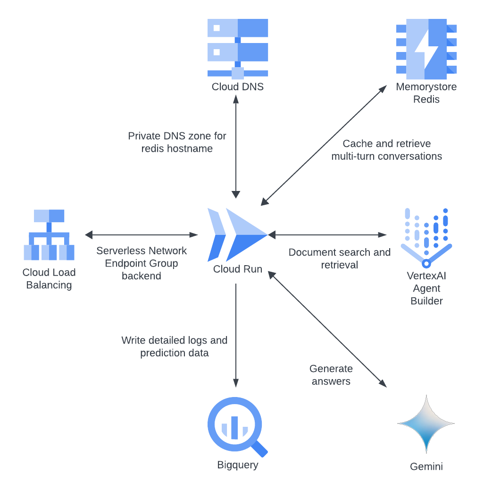

# VERTEX AI AGENT BUILDER ANSWER APP

## Overview
The Answer App uses [Vertex AI Agent Builder](https://cloud.google.com/generative-ai-app-builder/docs/introduction) and the [Discovery Engine API](https://cloud.google.com/generative-ai-app-builder/docs/reference/rest) to serve a conversational search experience with generative answers grounded on document data.

<!-- ## Architecture
- [Application Architecture](#architecture) -->

## Installation
- [Helper scripts](#helper-scripts)
- [Prerequisites](#prerequisites)
    - [OPTION 1: Deploying from Google Cloud Shell](#option-1-deploying-from-google-cloud-shell)
    - [OPTION 2: Deploying outside of Google Cloud Shell](#option-2-deploying-outside-of-google-cloud-shell)
- [Bootstrap](#bootstrap)
    - [Execute the bootstrap script](#execute-the-bootstrap-script)
- [Automate Deployments with Cloud Build](#automate-deployments-with-cloud-build)
    - [Set values in `config.yaml`](#1-set-configuration-values-in-configyaml)
    - [Connect your Cloud Run services to an existing load balancer](#to-connect-your-cloud-run-services-to-an-existing-load-balancer)
    - [Set environment variables](#2-set-environment-variables)
    - [Build & push the docker images and apply the Terraform configuration](#3-build--push-the-docker-images-and-apply-the-terraform-configuration)
- [Test the endpoint](#test-the-endpoint)
- [Add an A record to the DNS Managed Zone](#add-an-a-record-to-the-dns-managed-zone)
- [Import documents](#import-documents)
<!-- - [Configure Identity-Aware Proxy](#configure-identity-aware-proxy) -->

## Known Issues
- [Failure to create the Artifact Registry repository](#failure-to-create-the-artifact-registry-repository)
- [Errors adding users to Identity-Aware Proxy](#errors-adding-users-to-identity-aware-proxy)
- [Inconsistent Terraform plan](#inconsistent-terraform-plan)
- [Errors reading or editing Terraform resources](#errors-reading-or-editing-terraform-resources)

## Reference Info
- [Rollbacks](#rollbacks)
    - [Option 1: Use the Cloud Console to switch Cloud Run service traffic to a different revision](#option-1-use-the-cloud-console-to-switch-cloud-run-service-traffic-to-a-different-revision)
    - [Option 2: Rollback to a different Docker image using Terraform](#option-2-rollback-to-a-different-docker-image-using-terraform)
- [Execute Terraform to apply infrastructure-only changes to the `bootstrap` or `main` module](#execute-terraform-to-apply-infrastructure-only-changes-to-the-bootstrap-or-main-module)
- [Security](#security)
    - [Least Privilege Service Account roles](#least-privilege-service-account-roles)
    - [Service Account Impersonation](#service-account-impersonation)
    - [Data Encryption](#data-encryption)
- [Observability](#observability)
- [Terraform Overview](#terraform-overview)
    - [Terraform command alias](#terraform-command-alias)
    - [Initialize](#initialize)
    - [Workspaces](#workspaces)
    - [Terraform Backends](#terraform-backends)
    - [Flexible Backends - Partial Configuration](#flexible-backends---partial-configuration)
    - [Reconfiguring a Backend](#reconfiguring-a-backend)
    - [Plan and Apply](#plan-and-apply)

<!-- &nbsp;
# ARCHITECTURE
([return to top](#vertex-ai-agent-builder-answer-app))\


- Queries reach the T2X application through the [Cloud Load Balancer](https://cloud.google.com/load-balancing/docs/https).
- The T2X [backend service](https://cloud.google.com/load-balancing/docs/backend-service) is the interface for regional Cloud Run backends.
    - Regional failover: Cloud Run services [replicate](https://cloud.google.com/run/docs/resource-model#services) across more than one Compute zone to prevent outages for a single zonal failure.
    - Autoscaling: add/remove group instances to match demand and maintain a minimum number of instances for high availability.
- [Vertex AI Agent Builder](https://cloud.google.com/generative-ai-app-builder/docs/introduction) provides the [Search App and Data Store](https://cloud.google.com/generative-ai-app-builder/docs/create-datastore-ingest) for document search and retrieval.
- The application asynchronously writes log data to [BigQuery](https://cloud.google.com/bigquery/docs/introduction) for offline analysis.
- A [private DNS](https://cloud.google.com/dns/docs/zones#create-private-zone) hostname facilitates internal VPC communication with [Memorystore Redis](https://cloud.google.com/memorystore/docs/redis/memorystore-for-redis-overview) to support multi-turn conversations.
- [Gemini](https://cloud.google.com/vertex-ai/generative-ai/docs/learn/models) powers [generative answers](https://cloud.google.com/vertex-ai/generative-ai/docs/learn/overview). -->


&nbsp;
# INSTALLATION

&nbsp;
# Helper scripts
([return to top](#vertex-ai-agent-builder-answer-app))

Shell scripts in the `terraform/scripts` directory automate common tasks.
- `bootstrap.sh`: Prepare the target deployment project.
- `send_question.sh`: Send a question to the `answer-app` endpoint.
- `set_audience_and_token.sh`: Set the custom audience and ID token used to call the `answer-app` service.
- `set_variables.sh`: Set the environment variables for the shell session.
  - `PROJECT`: The Google Cloud project ID.
  - `REGION`: The default compute region.
  - `TF_VAR_project_id`: The Google Cloud project ID for Terraform.
  - `TF_VAR_terraform_service_account`: The Terraform service account email address.
  - `BUCKET`: The staging bucket for Vertex AI Data Store documents.
  - `REPO_ROOT`: The root directory of the cloned repository.
- `test_endpoint.sh`: Test the `answer-app` endpoint with a `curl` request.


&nbsp;
# Prerequisites
([return to top](#vertex-ai-agent-builder-answer-app))

- Your Google user account must be a [Project Owner](https://cloud.google.com/iam/docs/understanding-roles#owner) in the target project.
- [Clone the repository](https://docs.github.com/en/repositories/creating-and-managing-repositories/cloning-a-repository) and open a terminal session in the local repo directory.
- Make the helper scripts executable.
```sh
chmod +x scripts/*.sh # change the path if necessary
```

### OPTION 1: Deploying from [Google Cloud Shell](https://cloud.google.com/shell/docs/using-cloud-shell):

- Use Google Cloud Shell for a convenient environment with `gcloud` and `terraform` pre-installed.
- Your user account (`core.account`) and default project (`core.project`) should already be set up in the Cloud Shell environment.
- Confirm your `gcloud` configuration.:
```sh
gcloud config list --format=yaml
```
Example output:
```yaml
accessibility:
  screen_reader: 'True'
component_manager:
  disable_update_check: 'True'
compute:
  gce_metadata_read_timeout_sec: '30'
core:
  account: project-owner@example.com
  disable_usage_reporting: 'False'
  project: my-project-id
metrics:
  environment: devshell
```

- Optionally, set the default compute region (`compute.region`). The helper script will default to 'us-central1' if your `gcloud` configuration does not specify a region.
```sh
gcloud config set compute/region 'region' # replace with your preferred region if it's not 'us-central1'
```
Example output after setting the region to `us-west1`:
```yaml
accessibility:
  screen_reader: 'True'
component_manager:
  disable_update_check: 'True'
compute:
  gce_metadata_read_timeout_sec: '30'
  region: us-west1
core:
  account: project-owner@example.com
  disable_usage_reporting: 'False'
  project: my-project-id
metrics:
  environment: devshell
```

- Continue to the [Bootstrap](#bootstrap) step.

### OPTION 2: Deploying outside of Google Cloud Shell:
- Install [Terraform](https://learn.hashicorp.com/tutorials/terraform/install-cli).
- Install the [Google Cloud SDK](https://cloud.google.com/sdk/docs/install).
- Authenticate.
```sh
gcloud auth login
```

- Set the default project.
```sh
gcloud config set project 'my-project-id' # replace with your project ID
```

- Optionally, set the default compute region (`compute.region`). The helper script will default to 'us-central1' if your `gcloud` configuration does not specify a region.
```sh
gcloud config set compute/region 'region' # replace with your preferred region if it's not 'us-central1'
```

- Continue to the [Bootstrap](#bootstrap) step.


&nbsp;
# Bootstrap
([return to top](#vertex-ai-agent-builder-answer-app))

The `bootstrap.sh` script automates the `gcloud` and `terraform` commands required to prepare the project.
- Source the `set_variables.sh` script to configure the shell environment, including [Terraform environment variables](https://developer.hashicorp.com/terraform/language/values/variables#environment-variables). (Used automatically by later Terraform commands.).
- Enable the Service Usage, IAM, and Service Account Credentials APIs.
- Create a service account for Terraform provisioning.
- Grant the required [IAM roles](https://cloud.google.com/iam/docs/understanding-roles) to the service account.
- Prepare [Service Account Impersonation](https://cloud.google.com/iam/docs/service-account-impersonation) for the caller's user account.
- Create a Terraform [remote state](https://developer.hashicorp.com/terraform/language/state/remote) bucket.
- Initialize the Terraform `bootstrap` module and apply to provision resources required for the main module:
  - Project APIs.
  - Cloud Build service account.
  - Artifact Registry repository.
  - Staging bucket for Vertex AI data store documents.
  - IAM role bindings for the Cloud Build service account:
      - Project IAM policy: Cloud Build Service Account (`roles/cloudbuild.builds.builder`) role.
      - Terraform service account IAM policy: Service Account Token Creator (`roles/iam.serviceAccountTokenCreator`) role.

## Execute the bootstrap script.
- Source the `bootstrap.sh` script to set your shell variables and run the Terraform commands.
```sh
source scripts/bootstrap.sh # change the path if necessary
```


&nbsp;
# Automate Deployments with Cloud Build
([return to top](#vertex-ai-agent-builder-answer-app))

Use the [`gcloud CLI`](https://cloud.google.com/build/docs/running-builds/submit-build-via-cli-api) with [build config files](https://cloud.google.com/build/docs/configuring-builds/create-basic-configuration) to plan and deploy project resources.

## 1. Set configuration values in `config.yaml`.
Verify/Change parameters as needed:
- `app_name`: The name of the application. Used in cloud resource names (Cloud Run services, Cloud Load Balancer, etc.).
- `location`: The location for discoveryengine API (Agent Builder) resources, one of `us`, `eu`, or `global`.
- `data_store_id`: The Agent Builder Data Store ID to provision with Terraform.
- `search_engine_id`: The Agent Builder Search Engine ID to provision with Terraform.
- `customer_name`: The company name used in the Agent Builder Search Engine.
- `create_loadbalancer`: Boolean, set to `true` to provision an external application load balancer or set to `false` to skip creating the Cloud Load Balancer.
- `loadbalancer_domain`: The domain name you want to use for the Cloud Load Balancer front end.
  - **Requires setting `create_loadbalancer` to `true`.**
  - You need control of the DNS zone to [edit the A record](#add-an-a-record-to-the-dns-managed-zone).
  - Setting this value also configures Cloud Run to use the domain in a [custom audience](https://cloud.google.com/run/docs/configuring/custom-audiences) for authentication.
  - If left unset, Terraform will default to using [nip.io](https://nip.io) with the load balancer IP address and Cloud Run will not use a custom audience.


### TO CONNECT YOUR CLOUD RUN SERVICES TO AN EXISTING LOAD BALANCER
- Set `create_loadbalancer = false` **AND** set `global_lb_domain` to the value of the existing load balancer domain.
- Ensure the Terraform `cloud-run` module resource `google_compute_backend_service.t2x` argument [`load_balancing_scheme`](https://registry.terraform.io/providers/hashicorp/google/latest/docs/resources/compute_backend_service#load_balancing_scheme) matches the existing [load balancer type](https://cloud.google.com/load-balancing/docs/backend-service).
  - Use `load_balancing_scheme = "EXTERNAL_MANAGED"` for the Global external Application Load Balancer.
  - Use `load_balancing_scheme = "EXTERNAL"` for the Classic Application Load Balancer.
- Cloud Run services will use the load balancer domain in the custom audience for authentication.
- You must connect the backend services to the existing load balancer outside of this repo's Terraform configuration.


## 2. Set environment variables.
- Source the `set_variables.sh` script to configure the shell environment.
  - The `bootstrap.sh` script sources this file to set the environment variables and it's not necessary to run it again in the same shell session. Source `set_variables.sh` if you restarted your shell session or made changes to the environment variables.
```sh
source ./terraform/scripts/set_variables.sh # change the path if necessary
```

## 3. Build & push the docker images and apply the Terraform configuration
- Submit the build from the root directory as the build context.
- [OPTIONAL] Omit the `_RUN_TYPE=apply` substitution to run a plan-only build and review the Terraform changes before applying.
```sh
cd $REPO_ROOT
gcloud builds submit . --config=cloudbuild.yaml --project=$PROJECT --region=$REGION --impersonate-service-account=$TF_VAR_terraform_service_account --verbosity=error --substitutions="_RUN_TYPE=apply"
```

- Review the build logs in the [Cloud Build History](https://cloud.google.com/build/docs/view-build-results) to verify the build and deployment status.


&nbsp;
# Test the endpoint
([return to top](#vertex-ai-agent-builder-answer-app))

- A newly-created managed TLS certificate may take anywhere from 10-15 minutes up to 24 hours for the CA to sign after DNS propagates.
- The Certificate [Managed status](https://cloud.google.com/load-balancing/docs/ssl-certificates/troubleshooting#certificate-managed-status) will change from PROVISIONING to ACTIVE when it's ready to use.
- Navigate to Network Services > Load balancing > select the load balancer > Frontend: Certificate > Select the certificate and wait for the status to change to ACTIVE.

- Alternatively you can check the status using [`gcloud` commands](https://cloud.google.com/load-balancing/docs/ssl-certificates/google-managed-certs#gcloud_1)
```sh
gcloud compute ssl-certificates list --global # list all certificates and get the **CERTIFICATE_NAME**

gcloud compute ssl-certificates describe **CERTIFICATE_NAME** --global --format="get(name,managed.status, managed.domainStatus)"
```
- When the certificate is in `ACTIVE` status, verify the endpoint is reachable using the `test_endpoint.sh` helper script.
    - The script [authenticates](https://cloud.google.com/run/docs/authenticating/service-to-service) using a service account and the [Cloud Run custom audience](https://cloud.google.com/run/docs/configuring/custom-audiences) to [generate an ID token](https://cloud.google.com/docs/authentication/get-id-token#impersonation)

```sh
./scripts/test_endpoint.sh # change the path if necessary
```

- The server responds with a 200 status code and `{"status":"ok"}` if the endpoint is reachable and the TLS certificate is active.
- *It may take some more time after the certificate reaches ACTIVE Managed status before the endpoint responds with success. It may throw an SSLError due to mismatched client and server protocols until changes propagate.*
    - Example errors:
      - `curl: (35) LibreSSL/3.3.6: error:1404B410:SSL routines:ST_CONNECT:sslv3 alert handshake failure`
      - `curl: (35) LibreSSL SSL_connect: SSL_ERROR_SYSCALL in connection to 34.117.145.180.nip.io:443`


&nbsp;
# Add an A record to the DNS Managed Zone
([return to top](#vertex-ai-agent-builder-answer-app))

- **You do not need to configure DNS if you set `loadbalancer_domain` to `null` in `config.yaml` and instead used the default `nip.io` domain.**
- Use the public IP address created by Terraform as the A record in your DNS host. Steps vary by DNS provider.


&nbsp;
# Import documents
([return to top](#vertex-ai-agent-builder-answer-app))

- Refer to the Vertex AI Agent Builder Data Store documentation to [prepare data for ingestion](https://cloud.google.com/generative-ai-app-builder/docs/prepare-data).
- cloud-samples-data/gen-app-builder/search/cymbal-bank-employee


<!-- &nbsp;
# Configure Identity-Aware Proxy
([return to top](#vertex-ai-agent-builder-answer-app))
- Configuring IAP for an 'External' app is only possible from the Google Cloud Console.
- Ref - [Enable IAP for Cloud Run](https://cloud.google.com/iap/docs/enabling-cloud-run)
- Ref - [Setting up your OAuth consent screen](https://support.google.com/cloud/answer/10311615)

## Steps
1. Search for Identity-Aware Proxy (or "IAP") in the Console to navigate to it, then select "Enable API". Once the API is enabled, select "Go to Identity-Aware Proxy".  
2. You will be prompted to "Configure Consent Screen". A consent screen is what is shown to a user to display which elements of their information are requested by the app and to give them a chance to agree to that or not. Select "Configure Consent Screen".


3. Select a User Type of "External" to share the app with users outside of your organization's domain. Select "Continue".


4. When configuring your consent screen, identify your app with a name (ex. "Talk To Docs")  
5. Provide a user support email address (any).  
6. Under "Authorized domains" select "Add Domain" and then list the app top-level domain as Authorized domain 1.
    - i.e. if you used the hostname `app.example.com` then the top-level domain is `example.com`.
    - If you used the default domain using the `nip.io` service with a hostname like `35.244.148.105.nip.io`, then the top-level domain is `nip.io`.
7. Add your email address as the "Developer contact information" email address. Click "Save and continue". You can also click "Save and continue" on the following two screens, then on the Summary page click "Back to Dashboard."  
8. From the "OAuth consent screen" summary page, under Publishing Status, select "Publish app" and "Confirm". This will allow you to add any Google identity to which you grant the "IAP-secured Web App User" role to access the app, rather than additionally needing to add them as a test user on the OAuth consent screen.


9. Navigate back to the "Load Balancing" dashboard, select your load balancer, and then the Certificate name. If this is not yet ACTIVE, we will need to wait until it reaches ACTIVE status. Take a break and refresh occasionally.  
10. When the certificate is ACTIVE, navigate back to Identity-Aware Proxy by searching "IAP" at the top of the Console.  
11. Toggle on IAP protection of our backend service. The backend service may show a status of Error before you enable IAP, but enabling it should complete its configuration. You will be prompted to review configuration requirements, and then select the checkbox confirming your understanding and select "Turn On."  
>> Make sure to only enable IAP for `t2x-ui` and leave `t2x-api` without IAP enabled (since it is not being exposed).


12. Add a Google Identity (i.e a user or group) with the "IAP-secured Web App User" role.
    - See the [Known Issues](#errors-adding-users-to-identity-aware-proxy) section for information about "Policy updated failed" errors due to the [Domain restricted sharing Org policy](https://cloud.google.com/resource-manager/docs/organization-policy/restricting-domains#example_error_message).
13. You may see an "Error: Forbidden" message for about the first 5 minutes, but after that users with the "IAP-secured Web App User" role on the Project or IAP backend service should be able to access the app via the domain on the Load Balancer certificate.
    - i.e. `https://app.example.com` or `https://35.244.148.105.nip.io` -->


&nbsp;
# KNOWN ISSUES

## Failure to create the Artifact Registry repository
([return to top](#vertex-ai-agent-builder-answer-app))
### Problem
When running the `bootstrap` module, Terraform fails to create the Artifact Registry repository.

Example:
```
╷
│ Error: Error creating Repository: googleapi: Error 403: Permission 'artifactregistry.repositories.create' denied on resource '//artifactregistry.googleapis.com/projects/my-project-id/locations/us-central1' (or it may not exist).
│ Details:
│ [
│   {
│     "@type": "type.googleapis.com/google.rpc.ErrorInfo",
│     "domain": "artifactregistry.googleapis.com",
│     "metadata": {
│       "permission": "artifactregistry.repositories.create",
│       "resource": "projects/my-project-id/locations/us-central1"
│     },
│     "reason": "IAM_PERMISSION_DENIED"
│   }
│ ]
│ 
│   with google_artifact_registry_repository.cloud_run,
│   on main.tf line 38, in resource "google_artifact_registry_repository" "cloud_run":
│   38: resource "google_artifact_registry_repository" "cloud_run" {
│ 
╵
```

### Solution
The error occurs on the first run of the `bootstrap` module due to a race condition between the Artifact Registry API activation and applying the Terraform plan. The API activation can take a few minutes to complete. Rerun the `bootstrap.sh` script or manually re-apply the `bootstrap` module configuration.

## Errors adding users to Identity-Aware Proxy
([return to top](#vertex-ai-agent-builder-answer-app))
### Problem
When [adding members to the IAP-secured backend service](#configure-identity-aware-proxy), a [Domain restricted sharing Org policy](https://cloud.google.com/resource-manager/docs/organization-policy/restricting-domains) causes an error message like this:\
\

### Solution
1. [Edit the policy](https://cloud.google.com/resource-manager/docs/organization-policy/creating-managing-policies#creating_and_editing_policies) to temporarily disable it.
2. Add the members to IAP-protected backend service IAM policy.
3. Re-enable the policy.

## Inconsistent Terraform plan
### Problem
The Terraform Google provider sometimes returns an inconsistent plan during `apply` operations.

Example:
```
│ Error: Provider produced inconsistent final plan
│ 
│ When expanding the plan for google_compute_region_backend_service.t2x_backend_api to include new values learned so far during apply, provider "registry.terraform.io/hashicorp/google" produced an invalid new value for
│ .backend: planned set element cty.ObjectVal(map[string]cty.Value{"balancing_mode":cty.StringVal("UTILIZATION"), "capacity_scaler":cty.NumberIntVal(1), "description":cty.StringVal(""), "failover":cty.UnknownVal(cty.Bool),
│ "group":cty.UnknownVal(cty.String), "max_connections":cty.NullVal(cty.Number), "max_connections_per_endpoint":cty.NullVal(cty.Number), "max_connections_per_instance":cty.NullVal(cty.Number),
│ "max_rate":cty.NullVal(cty.Number), "max_rate_per_endpoint":cty.NullVal(cty.Number), "max_rate_per_instance":cty.NullVal(cty.Number), "max_utilization":cty.MustParseNumberVal("0.8")}) does not correlate with any element
│ in actual.
│ 
│ This is a bug in the provider, which should be reported in the provider's own issue tracker.
```

### Solution
You can usually ignore the error messages because the resources get successfully created or updated. If the error persists, try running `terraform apply` again or refer to the provider's documentation.

## Errors reading or editing Terraform resources
([return to top](#vertex-ai-agent-builder-answer-app))
### Problem
Intermittent connectivity issues (for example, while using a VPN) can cause unresponsiveness during `plan` or `apply` operations.

Example:
```
│ Error: Error when reading or editing RedisInstance "projects/my-project/locations/us-central1/instances/my-redis-instance": Get "https://redis.googleapis.com/v1/projects/my-project/locations/us-central1/instances/my-redis-instance?alt=json": write tcp [fe80::ca4b:d6ff:fec7:8a11%utun1]:59235->[2607:f8b0:4009:809::200a]:443: write: socket is not connected
│ 
│   with google_redis_instance.default,
│   on redis.tf line 79, in resource "google_redis_instance" "default":
│   79: resource "google_redis_instance" "default" {
│ 
╵
```

### Solution
Retry the operation to clear the error. If the error persists, check your network or VPN connection and try again.


&nbsp;
# REFERENCE INFORMATION

&nbsp;
# Rollbacks
([return to top](#vertex-ai-agent-builder-answer-app))

## Option 1: Use the Cloud Console to switch Cloud Run service traffic to a different revision
### **THIS WILL CHANGE STATE OUTSIDE OF TERRAFORM CONTROL**
- Navigate to the Cloud Run service in the Cloud Console.
- Click the 'Revisions' tab.
- Click 'MANAGE TRAFFIC'.
- Select the target revision and traffic percentage (100% to rollback completely to another revision).
- Click 'SAVE'.

## Option 2: Rollback to a different Docker image using Terraform
- Identify the rollback target Docker image.
- Pass the target image name and tag to the `docker_image` [input variable](https://developer.hashicorp.com/terraform/language/values/variables#assigning-values-to-root-module-variables) in the `t2x-app/main` root module.
    - Use a `.tfvars` file, the `-var` command line argument, or the `TF_VAR_` [environment variable](https://developer.hashicorp.com/terraform/language/values/variables#environment-variables).
- Apply the Terraform configuration to update the Cloud Run service to the rollback target.

### Example: select an image by digest or tag from Artifact Registry.
- Set the project ID and service account environment variables.
```sh
source scripts/set_variables.sh
```

- Initialize the Terraform `main` module configuration with the remote state by passing required arguments to the partial backend.
```sh
terraform init -backend-config="bucket=$BUCKET" -backend-config="impersonate_service_account=$TF_VAR_terraform_service_account"
```

- Set the Terraform input environment variables to the target image names.
```sh
export TF_VAR_docker_image="us-central1-docker.pkg.dev/my-project-id/answer-app/answer-app@sha256:4f2092b926b7e9dc30813e819bb86cfa7d664eede575539460b4a68bbd4981e1"
# OR
export TF_VAR_docker_image="us-central1-docker.pkg.dev/my-project-id/answer-app/answer-app:latest"
```

- Apply the Terraform configuration to update the Cloud Run service to the target image.
```sh
terraform apply
```


&nbsp;
# Execute Terraform to apply infrastructure-only changes to the `bootstrap` or `main` module.
([return to top](#vertex-ai-agent-builder-answer-app))

Applying the resources from the `bootstrap` module is a one-time setup for a new project. You can re-run it, for example, to add or enable additional APIs to support future development. You can apply infrastructure-only changes to the `main` module to update cloud resources without rebuilding the Docker images (and without using Cloud Build). If you don't provide docker image names as input variables, the `main` retrieves the last-deployed Docker images from the module state and reuses them in the Cloud Run services.

1. Source the `set_variables.sh` script to configure the shell environment (provides variables including `PROJECT` and `REPO_ROOT`). Refer to the [Prerequisites](#prerequisites) section for details on configuring the `gcloud` CLI.
```sh
source ./scripts/set_variables.sh # change the path if necessary
```

2. Initialize the Terraform `main` or `bootstrap` module using a [partial backend configuration](https://developer.hashicorp.com/terraform/language/settings/backends/configuration#partial-configuration).
    - See the [Terraform Backends](#terraform-backends) section for more information.
    - You might need to [reconfigure the backend](#reconfiguring-a-backend) if you've already initialized the module.
```sh
cd $REPO_ROOT/terraform/main # or cd $REPO_ROOT/terraform/bootstrap
terraform init -backend-config="bucket=$BUCKET" -backend-config="impersonate_service_account=$TF_VAR_terraform_service_account"
```

3. Apply the Terraform configuration to provision the cloud resources.
```sh
terraform apply
```

&nbsp;
# Security
([return to top](#vertex-ai-agent-builder-answer-app))

## **Least privilege Service Account roles**
Assign the [minimum required permissions](https://cloud.google.com/iam/docs/using-iam-securely#least_privilege) to the Cloud Run service account using these IAM roles:
- `roles/aiplatform.user`
- `roles/bigquery.dataEditor`
- `roles/bigquery.user`
- `roles/gkemulticloud.telemetryWriter`
- `roles/storage.objectUser`

Assign specific Admin roles for the Terraform provisioning service account:
- Artifact Registry Administrator (`roles/artifactregistry.admin`)
- BigQuery Admin (`roles/bigquery.admin`)
- Cloud Build Editor (`roles/cloudbuild.builds.editor`)
<!-- - Cloud Memorystore Redis Admin (`roles/redis.admin`) -->
- Cloud Run Admin (`roles/run.admin`)
<!-- - Compute Admin (`roles/compute.admin`) -->
- Discovery Engine Admin (`roles/discoveryengine.admin`)
<!-- - DNS Admin (`roles/dns.admin`) -->
- Project IAM Admin (`roles/resourcemanager.projectIamAdmin`)
<!-- - Security Admin (`roles/iam.securityAdmin`) - required to [set IAM policies on DNS Managed Zones](https://cloud.google.com/dns/docs/zones/iam-per-resource-zones#expandable-1) -->
- Service Account Admin (`roles/iam.serviceAccountAdmin`)
- Service Account User (`roles/iam.serviceAccountUser`) - required to [attach service accounts to resources](https://cloud.google.com/iam/docs/attach-service-accounts)
- Service Usage Admin (`roles/serviceusage.serviceUsageAdmin`)
- Storage Admin (`roles/storage.admin`)
- Vertex AI Administrator (`roles/aiplatform.admin`)
<!-- - Workflows Admin (`roles/workflows.admin`) -->

## **[Service account impersonation](https://cloud.google.com/iam/docs/service-account-impersonation)**
Instead of creating and managing Service Account keys for authentication, this code uses an [impersonation pattern for Terraform](https://cloud.google.com/blog/topics/developers-practitioners/using-google-cloud-service-account-impersonation-your-terraform-code) to fetch access tokens on behalf of a Google Cloud IAM Service Account.

- Grant the caller (a Google user account or group address) permission to generate [short-lived access tokens](https://cloud.google.com/iam/docs/create-short-lived-credentials-direct) on behalf of the targeted service account.
    - The caller needs the Account Token Creator role (`roles/iam.serviceAccountTokenCreator`) or a custom role with the `iam.serviceAccounts.getAccessToken` permission that applies to the Terraform provisioning service account.
    - Create a [role binding on the Service Account resource](https://cloud.google.com/iam/docs/manage-access-service-accounts#single-role) instead of the project IAM policy to [minimize the scope of the permission](https://cloud.google.com/iam/docs/best-practices-service-accounts#project-folder-grants).
    - Perhaps counterintuitively, the primitive Owner role (`roles/owner`) does NOT include this permission.
```sh
export MEMBER='user:{your-username@example.com}' # replace '{your-username@example.com}' from 'user:{your-username@example.com}' with your Google user account email address
# Example to add a group -> export MEMBER='group:devops-group@example.com'

gcloud iam service-accounts add-iam-policy-binding "terraform-service-account@${PROJECT}.iam.gserviceaccount.com" --member=$MEMBER --role="roles/iam.serviceAccountTokenCreator"
```
- Use the `google_service_account_access_token` [Terraform data source](https://registry.terraform.io/providers/hashicorp/google/latest/docs/data-sources/service_account_access_token) to generate short-lived credentials [instead of service account keys](https://cloud.google.com/iam/docs/best-practices-for-managing-service-account-keys#alternatives).

&nbsp;
# Terraform Overview
This overview document provides general instructions to initialize a Terraform workspace/environment, set up a backend configuration and bucket for storing Terraform state, and lists some known issues.


- [Terraform command alias](#terraform-command-alias)
- [Initialize](#initialize)
- [Workspaces](#workspaces)
- [Terraform Backends](#terraform-backends)
- [Flexible Backends - Partial Configuration](#flexible-backends---partial-configuration)
- [Reconfiguring a Backend](#reconfiguring-a-backend)
- [Plan and Apply](#plan-and-apply)
- [Known issues](#known-issues)


## Terraform command alias
Commands in this section assume `tf` is an [alias](https://cloud.google.com/docs/terraform/best-practices-for-terraform#aliases) for `terraform` in your shell.

## Initialize
The Terraform working directory must be [initialized](https://developer.hashicorp.com/terraform/cli/init) to set up configuration files and download provider plugins.
```sh
# Initialize the working directory.
tf init
```

## Workspaces
[Terraform workspaces](https://developer.hashicorp.com/terraform/cli/workspaces) allow separation of environments so each is managed in a unique state file.

```sh
# View the active and available workspaces (Terraform starts with only the 'default' workspace).
tf workspace list

# Set an environment variable for the deployment environment/workspace name.
export ENVIRONMENT='sandbox'

# Create an environment-specific workspace.
tf workspace new $ENVIRONMENT

# Choose a workspace.
tf workspace select default

# Select a workspace or create it if it doesn't exist.
tf workspace select -or-create nonprod
```

## Terraform Backends
Using a local backend doesn't require additional configuration. A [Cloud Storage backend](https://developer.hashicorp.com/terraform/language/settings/backends/configuration) requires these prerequisites:
- The GCS backend bucket must already exist - Terraform will not create it at `init`.
Example (edit with your actual project and bucket name):
```sh
gcloud storage buckets create gs://my-terraform-bucket --project=my-project --uniform-bucket-level-access
```
- The caller or impersonated service account needs permission to read and write to the bucket.
- Define a GCS backend in the `terraform.backend` block.

```terraform
terraform {
  backend "gcs" {
    bucket                      = "my-terraform-bucket"
    impersonate_service_account = "terraform-service-account@my-project-id..iam.gserviceaccount.com"
    prefix                      = "terraform_state/"
  }
  required_providers {
    google = {
      source  = "hashicorp/google"
      version = "5.25.0"
    }
  }
  required_version = ">= 0.13"
}
```

## Flexible Backends - Partial Configuration
- Backend declaration can't accept input variables or use expansion/interpolation because Terraform loads the backend config before anything else.
- A [partial configuration](https://developer.hashicorp.com/terraform/language/settings/backends/configuration#partial-configuration) in the `terraform.backend` block allows flexible backend definition for multiple environments.
- Partial configurations allow you to include some attributes in the `terraform.backend` block and pass the rest from another source.
- Options for supplying backend configuration arguments include a file, command-line key/value arguments, [environment variables](https://developer.hashicorp.com/terraform/cli/config/environment-variables), or interactive prompts.
- Define the remaining backend details in a dedicated `*.gcs.tfbackend` file, i.e. `backend_sandbox.gcs.tfbackend` and pass it's path as a command-line argument to separate backends per environment. (Hashicorp docs recommend a `*.backendname.tfbackend` naming convention, but Terraform will accept any correctly-formatted file. IDE syntax highlighting and linting might not pick up `.tfbackend` files.)

### Partial backend configuration example:
`backend.tf`:
```hcl
terraform {
  backend "gcs" {
    prefix = "bootstrap"
  }
  required_providers {
    google = {
      source  = "hashicorp/google"
      version = ">=5.25.0"
    }
  }
  required_version = ">= 0.13"
}

```

- Example 1 - initialize a partial backend using an environment-specific backend configuration file:
```sh
# Create a workspace-specific backend configuration file for the Google Cloud Storage backend.
cat << EOF > backend_$ENVIRONMENT.gcs.tfbackend
bucket                      = "terraform-state-my-project-id"
impersonate_service_account = "terraform-service-account@my-project-id.iam.gserviceaccount.com"
EOF

# Initialize the remote state
tf init -backend-config="backend_$ENVIRONMENT.gcs.tfbackend"
```

- Example 2 - initialize a partial backend using command-line arguments:
```sh
tf init -backend-config="bucket=terraform-state-my-project-id" -backend-config="impersonate_service_account=terraform-service-account@my-project-id.iam.gserviceaccount.com"
```


## Reconfiguring a Backend
To force Terraform to use a new backend without [migrating](https://spacelift.io/blog/terraform-migrate-state) state data from an existing backend, [initialize](https://developer.hashicorp.com/terraform/cli/commands/init#backend-initialization) with the `-reconfigure` flag. The existing state in the old backend is left unchanged and not copied to the new backend.
```sh
tf init -reconfigure -backend-config="backend_$ENVIRONMENT.gcs.tfbackend
```

## Plan and Apply
Terraform requires declared or default values for [input variables](https://developer.hashicorp.com/terraform/language/values/variables#assigning-values-to-root-module-variables). For example, variables defined in `.tfvars` files to separate environments.

```sh
# Define environment-specific variables in a .tfvars file
cat << EOF > vars_$ENVIRONMENT.tfvars
project_id                = "my-project"
terraform_service_account = "terraform-sa@my-project.iam.gserviceaccount.com"
terraform_bucket_name     = "my-terraform-bucket"
region                    = "us-central1"
zone                      = "us-central1-a"
EOF

# View the Terraform plan.
tf plan -var-file="vars_$ENVIRONMENT.tfvars"

# Apply changes.
tf apply -var-file="vars_$ENVIRONMENT.tfvars"

```
