# VERTEX AI AGENT BUILDER ANSWER APP

The Answer App uses [Vertex AI Agent Builder](https://cloud.google.com/generative-ai-app-builder/docs/introduction) and the [Discovery Engine API](https://cloud.google.com/generative-ai-app-builder/docs/reference/rest) to serve a [conversational search experience](https://cloud.google.com/generative-ai-app-builder/docs/answer) with generative answers grounded on document data.

### Why would I want to use this?

- **Fully-managed conversational search**: Use the [Answer method](https://cloud.google.com/generative-ai-app-builder/docs/reference/rpc/google.cloud.discoveryengine.v1#conversationalsearchservice) ([REST reference](https://cloud.google.com/generative-ai-app-builder/docs/reference/rest/v1/projects.locations.dataStores.servingConfigs/answer)) for a stateful multi-turn conversational search with generative answers.
- **Production-capable performance**: Autoscaling, concurrency, and regional redundancy via multiple Cloud Run services.
- **Integration flexibility**: Authenticated external HTTPS endpoint for 3rd party systems (using Google-managed TLS).
- **Resource observability**: Single-pane-of-glass Cloud Monitoring dashboard with customizable metrics and alerts.
- **Explainable and debuggable results**: Investigate generative answers using the full RAG pipeline results logged to BigQuery.
- **Data-driven LLM-ops**: Tune the conversational search agent using question/answer pairs labelled with user feedback.
- **Identity-Aware Proxy**: Secure access control.
- **Automated deployments**: One-click install and uninstall with Terraform and Cloud Build.


### Why would I not want to use this?

When all you want to do is test or demonstrate Vertex AI conversational search, [create a search app](https://cloud.google.com/generative-ai-app-builder/docs/create-engine-es) and [preview the widget](https://cloud.google.com/generative-ai-app-builder/docs/configure-widget-attributes) in the Cloud Console or [embed it in a web page](https://cloud.google.com/generative-ai-app-builder/docs/add-widget).


&nbsp;
## TABLE OF CONTENTS

### Architecture
- [Diagram](#diagram)
- [Description](#description)

### Installation
- [Prerequisites](#prerequisites)
- [Configure the OAuth Consent Screen for User Authentication](#configure-the-oauth-consent-screen-for-user-authentication)
- [Deploy Resources](#deploy-resources)
- [Add an A record to the DNS Managed Zone](#add-an-a-record-to-the-dns-managed-zone)
- [Enable Vertex AI Agent Builder](#enable-vertex-ai-agent-builder)
- [Test the endpoint](#test-the-endpoint)
- [Import documents](#import-documents)
- [Configure Identity-Aware Proxy](#configure-identity-aware-proxy)
- [Use the app](#use-the-app)

### Un-Installation
- [Uninstall](#uninstall)

### Tests
- [Unit Tests](#unit-tests)
- [Run locally](#run-locally)

### Known Issues
- [Failure to create the Artifact Registry repository](#failure-to-create-the-artifact-registry-repository)
- [Cloud Build fails with a Cloud Storage 403 permission denied error](#cloud-build-fails-with-a-cloud-storage-403-permission-denied-error)
- [Error creating a DataStore (named DataStore being deleted)](#error-creating-a-datastore-named-datastore-being-deleted)
- [Errors adding users to Identity-Aware Proxy](#errors-adding-users-to-identity-aware-proxy)
- [Errors reading or editing Terraform resources](#errors-reading-or-editing-terraform-resources)
- [The Search Agent refuses to answer questions](#the-search-agent-refuses-to-answer-questions)

### Next Steps
- [Features to add](#features-to-add)

### Reference Information
- [Answer Method Configuration Options](#answer-method-configuration-options-python)
- [Helper Scripts](#helper-scripts)
- [Bootstrap](#bootstrap)
- [Automate Deployments with Cloud Build](#automate-deployments-with-cloud-build)
- [Connect cloud run services to an existing load balancer](#connect-cloud-run-services-to-an-existing-load-balancer)
- [Rollbacks](#rollbacks)
- [Execute Terraform to apply infrastructure-only changes to the `bootstrap` or `main` module](#execute-terraform-to-apply-infrastructure-only-changes-to-the-bootstrap-or-main-module)
- [Un-Bootstrap](#un-bootstrap)
- [Service Account Impersonation](#service-account-impersonation)
- [Terraform Overview](#terraform-overview)


&nbsp;
# ARCHITECTURE

### Diagram
([return to top](#vertex-ai-agent-builder-answer-app))\


### Description
([return to top](#vertex-ai-agent-builder-answer-app))
- Client requests reach the application through the [Cloud Load Balancer](https://cloud.google.com/load-balancing/docs/https).
- The [backend service](https://cloud.google.com/load-balancing/docs/backend-service) is the interface for regional [serverless network endpoint group](https://cloud.google.com/load-balancing/docs/backend-service#serverless_network_endpoint_groups) backends composed of [Cloud Run](https://cloud.google.com/run/docs/overview/what-is-cloud-run) services.
    - Zonal failover: Cloud Run services [replicate](https://cloud.google.com/run/docs/resource-model#services) across multiple zones within a [Compute region](https://cloud.google.com/run/docs/locations) to prevent outages for a single zonal failure.
    - [Autoscaling](https://cloud.google.com/run/docs/about-instance-autoscaling): add/remove group instances to match demand and maintain a minimum number of instances for high availability.
    - [Concurrency](https://cloud.google.com/run/docs/about-concurrency): multiple requests processed simultaneously by a given instance.
    - [Regional redundancy](https://cloud.google.com/run/docs/multiple-regions): deploy services across multiple regions to deliver low latency and higher availability in case of regional outages.
- [Vertex AI Agent Builder](https://cloud.google.com/generative-ai-app-builder/docs/introduction) provides the [Search App and Data Store](https://cloud.google.com/generative-ai-app-builder/docs/create-datastore-ingest) for document search and retrieval.
- The Vertex AI Search [answer method](https://cloud.google.com/generative-ai-app-builder/docs/answer) uses Gemini-based [answer generation models](https://cloud.google.com/generative-ai-app-builder/docs/answer-generation-models) to power [generative answers](https://cloud.google.com/vertex-ai/generative-ai/docs/overview).
- The application asynchronously writes log data and user feedback responses to [BigQuery](https://cloud.google.com/bigquery/docs/introduction) for offline analysis.


&nbsp;
# INSTALLATION

## Prerequisites
([return to top](#vertex-ai-agent-builder-answer-app))

- Your Google user account must be a [Project Owner](https://cloud.google.com/iam/docs/roles-overview#legacy-basic) in the target Google Cloud project.
- Choose one of the following options to install and configure [Terraform](https://developer.hashicorp.com/terraform) and the [`gcloud` CLI](https://cloud.google.com/sdk/gcloud) for your development environment:
    - Follow the instructions in [OPTION 1](#option-1-deploying-from-google-cloud-shell) to configure deployment using [Google Cloud Shell](https://cloud.google.com/shell/docs/using-cloud-shell).
    - Follow the instructions in [OPTION 2](#option-2-deploying-outside-of-google-cloud-shell) to configure deployment from your local terminal.

### OPTION 1: Deploying from Google Cloud Shell:
Use [Cloud Shell](https://cloud.google.com/shell/docs/using-cloud-shell) for a convenient environment with `gcloud` and `terraform` pre-installed. Your user account (`core.account`) and default project (`core.project`) should already be set in the Cloud Shell environment.

1. Select your target deployment project in the [Cloud Console](https://console.cloud.google.com/projectselector2/home/dashboard).
2. [Open Cloud Shell](https://cloud.google.com/shell/docs/launching-cloud-shell) and confirm your `gcloud` configuration.
```sh
gcloud config list --format=yaml
```
Example output:
```yaml
accessibility:
  screen_reader: 'True'
component_manager:
  disable_update_check: 'True'
compute:
  gce_metadata_read_timeout_sec: '30'
core:
  account: project-owner@example.com
  disable_usage_reporting: 'False'
  project: my-project-id
metrics:
  environment: devshell
```

3. Optionally, set the default compute region (`compute.region`). The helper script will default to `us-central1` if your `gcloud` configuration does not specify a region.
    - Agree to enable the `compute.googleapis.com` API if prompted.
```sh
gcloud config set compute/region 'region' # replace with your preferred region, e.g. us-central1
```

4. Set any other [configuration values](https://cloud.google.com/sdk/gcloud/reference/config/set) as needed.

5. Consider using Personal Access Tokens (PATs) to [clone the `answer-app` repo](https://docs.github.com/en/github/authenticating-to-github/keeping-your-account-and-data-secure/creating-a-personal-access-token) as an alternative to managing SSH keys in Cloud Shell.


### OPTION 2: Deploying outside of Google Cloud Shell:
1. Install [Terraform](https://learn.hashicorp.com/tutorials/terraform/install-cli).
2. Install the [Google Cloud SDK](https://cloud.google.com/sdk/docs/install).
3. Authenticate.
```sh
gcloud auth login
```

4. Set the target deployment project as your default.
```sh
gcloud config set project 'my-project-id' # replace with your project ID
```

5. Configure [Application Default Credentials (ADC)](https://cloud.google.com/docs/authentication/application-default-credentials) for local development.
```sh
gcloud auth application-default login
```

6. Optionally, set the default compute region (`compute.region`). The helper script will default to `us-central1` if your `gcloud` configuration does not specify a region.
    - Agree to enable the `compute.googleapis.com` API if prompted.
```sh
gcloud config set compute/region 'region' # replace with your preferred region, e.g. 'us-central1'
```

7. [Clone the repository](https://docs.github.com/en/repositories/creating-and-managing-repositories/cloning-a-repository) and open a terminal session in the repo root (`answer-app`) directory.


&nbsp;
## Configure the OAuth Consent Screen for User Authentication
([return to top](#vertex-ai-agent-builder-answer-app))

The `answer-app-client` uses [Google OAuth 2.0](https://developers.google.com/identity/protocols/oauth2) with Streamlit's [`st.login`](https://docs.streamlit.io/develop/api-reference/user/st.login) feature to securely access limited user profile data for personalized sessions. You must use the Google Cloud Console to initialize the project's [OAuth consent screen](https://developers.google.com/workspace/guides/configure-oauth-consent) (a.k.a. "App Branding") before enabling [OAuth client](https://support.google.com/cloud/answer/15549257) credentials for the `answer-app-client` application. A consent screen is what is shown to a user to display which elements of their information are requested by the app and to let them choose whether to proceed.

### 1. Create Branding
**Reference:** [Manage OAuth App Branding](https://support.google.com/cloud/answer/15549049)
- In the Google Cloud console, go to Menu > Google Auth platform > [Branding](https://console.cloud.google.com/auth/branding). Click "Get started" if you see the message " Google Auth Platform not configured yet".
- Enter an App name (e.g. "Anser App") and an email address you control for User support email.
- Choose External audience.
- Enter a developer contact email address (any address you control, can be the same as the support email).
- Check the box to agree to the data policy and click Create.

<details>
<summary style="cursor: pointer; font-weight: bold; color: #8833c5;">
🖼️ Show/Hide Screenshots
</summary>

<div style="margin-top: 10px;">

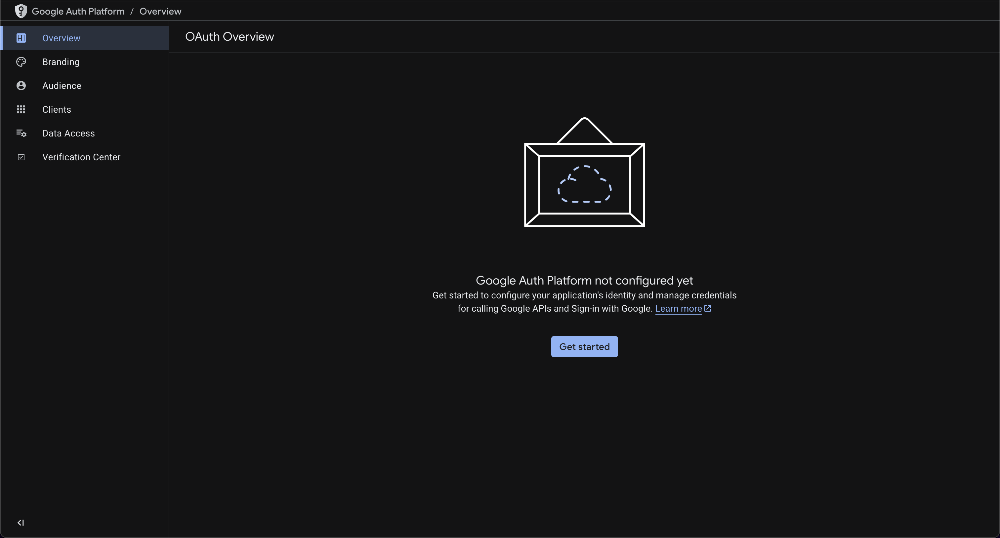
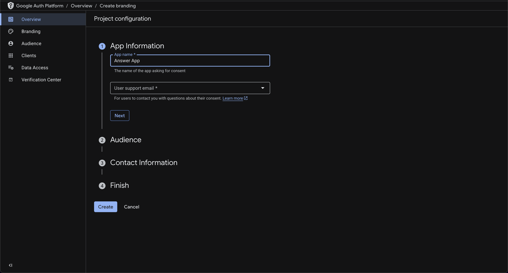
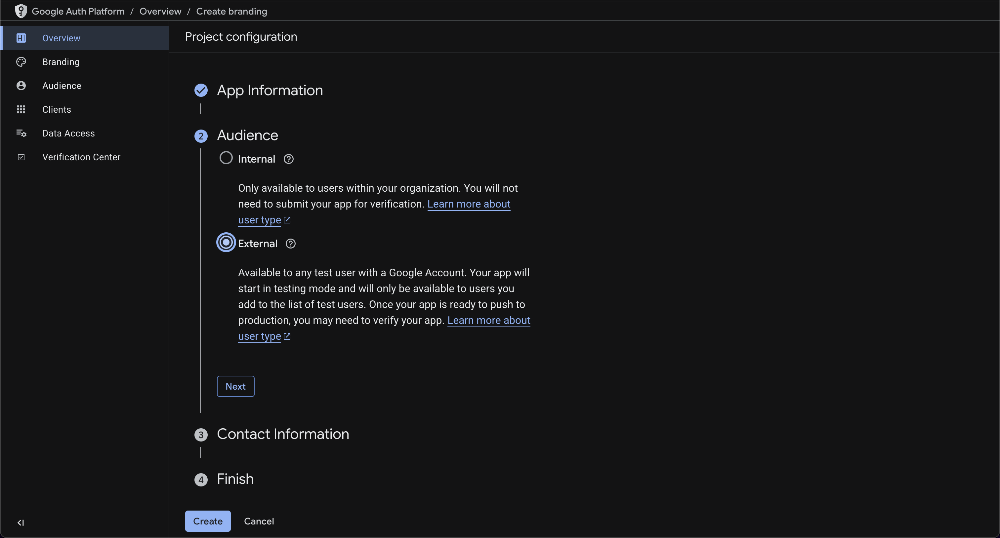
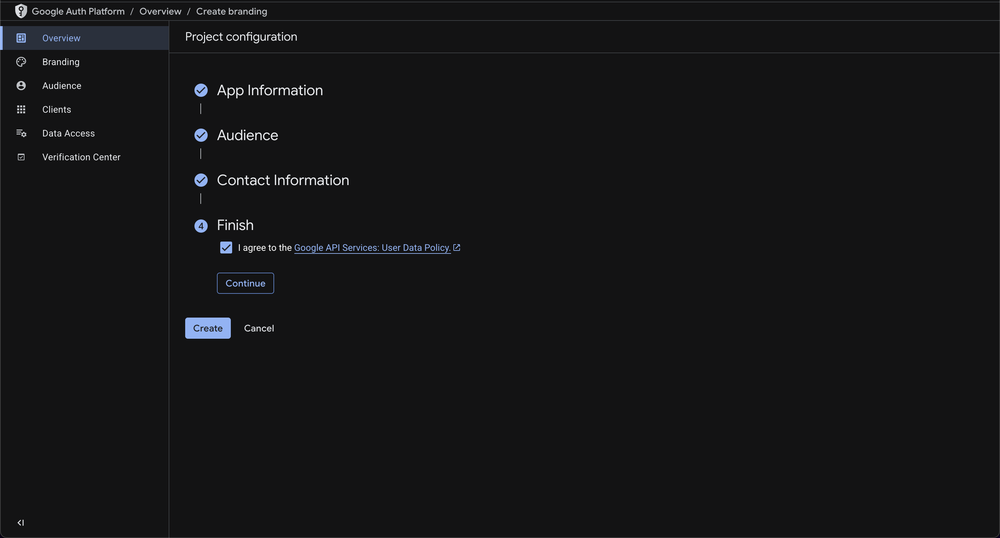

</div>
</details>

### 2. Create an OAuth Client
**Reference:** [Manage OAuth Clients](https://support.google.com/cloud/answer/15549257)
- Navigate in the Cloud Console to Google Auth Platform > [Clients](https://console.cloud.google.com/auth/clients) > Create client.
- Create a "Web application" type and name the OAuth client (e.g "answer-app-oauth-client").
- Click Add URI under Authorized Redirect URIs and add `URIs 1` For local testing: `http://localhost:8080/oauth2callback`.
    - Only add the `localhost` redirect URI at this time and don't enter any additional URIs.
    - After deployment you'll return to the Cloud Console and [add `URIs 2` for the deployed app](#update-the-oauth-client-authorized-uris): i.e. a value similar to `https://app.example.com/oauth2callback` or `https://35.244.148.105.sslip.io/oauth2callback` depending on your selected load balancer domain or deployed IP address.
- Click Create.
- Click "Download JSON" in the next dialog popup to save the OAuth client data to your device.
- Save the downloaded JSON file to the local repository `.streamlit/secrets` directory.
    - The `.streamlit/secrets` subdirectory is an ignore pattern in the repo root `.gcloudignore` file.
    - It should exist as an otherwise empty directory containing a `.gitignore` file to prevent committing sensitive data.

<details>
<summary style="cursor: pointer; font-weight: bold; color: #8833c5;">
🖼️ Show/Hide Screenshots
</summary>

<div style="margin-top: 10px;">

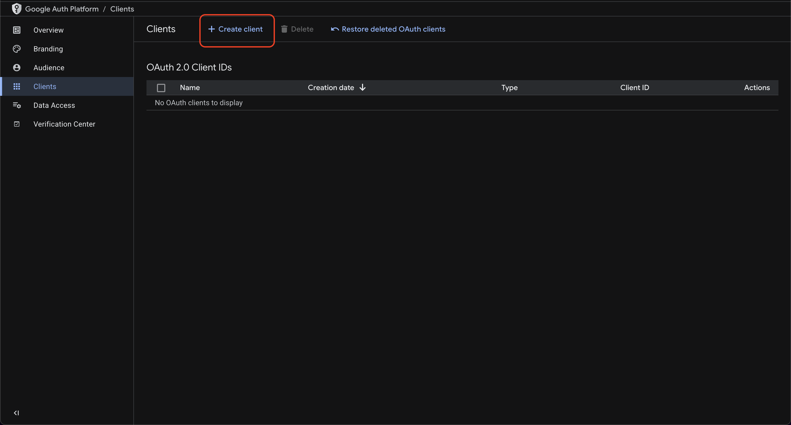
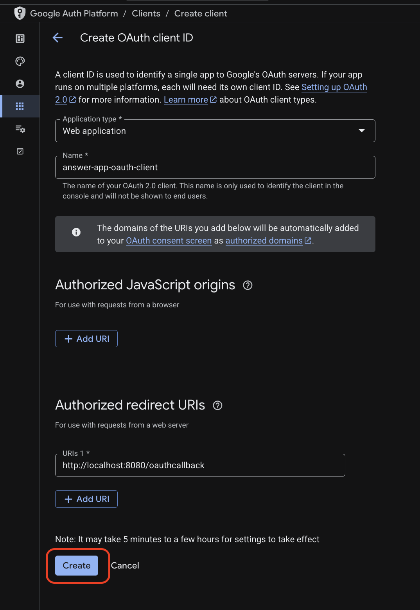
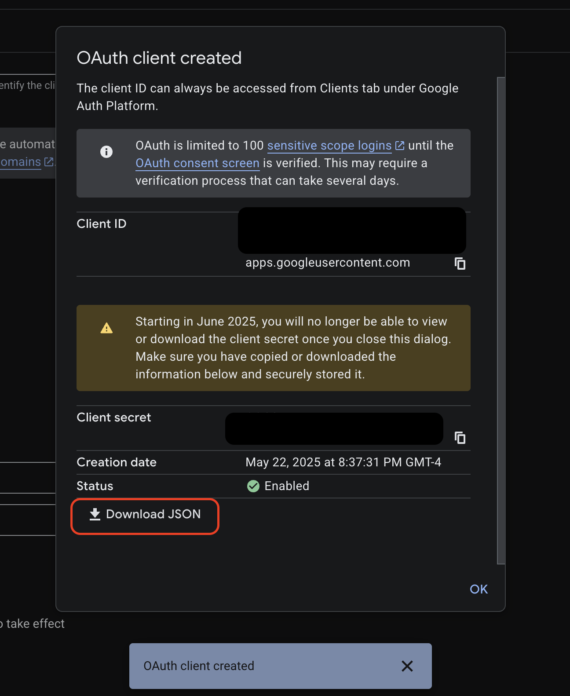

</div>
</details>

### 3. Upload the Client Secrets file to Secret Manager
**Reference:** [Add a secret version](https://cloud.google.com/secret-manager/docs/add-secret-version)
- Navigate in the Cloud Console to Security > [Secret Manager](https://console.cloud.google.com/security/secret-manager).
- Enable the API if prompted.
- Click CREATE SECRET.
- Name the secret `answer-app-oauth-client-secret-json`.
- Under Secret value, click BROWSE to upload the client secret JSON file from the previous step.
- Click CREATE SECRET.

<details>
<summary style="cursor: pointer; font-weight: bold; color: #8833c5;">
🖼️ Show/Hide Screenshots
</summary>

<div style="margin-top: 10px;">

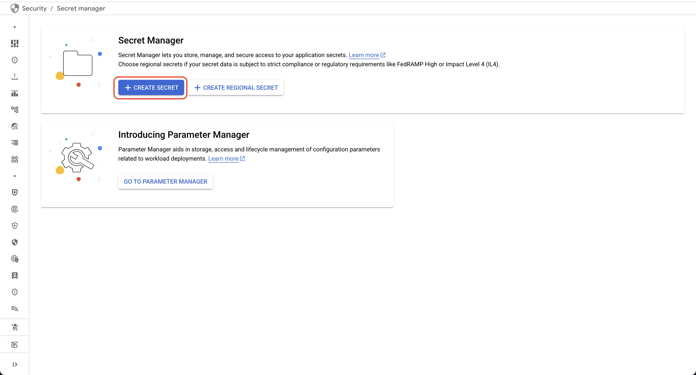
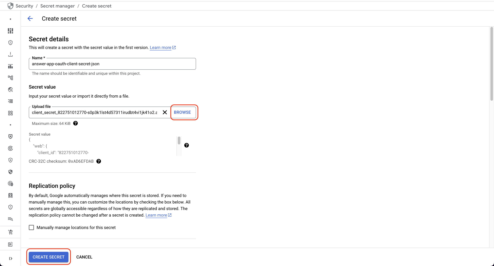

</div>
</details>

### 4. Enable a Public Audience
**Reference:** [Manage App Audience](https://support.google.com/cloud/answer/15549945)
- Navigate in the Cloud Console to Google Auth Platform > [Audience](https://console.cloud.google.com/auth/audience)
- Click Publish app under Publishing status
- Click Confirm in the Push to production? dialog box.

A public audience (an "External" User Type and "In production" Publishing status) allows you to add any Google identity to the [Identity Aware Proxy access policy](#configure-identity-aware-proxy).

<details>
<summary style="cursor: pointer; font-weight: bold; color: #8833c5;">
🖼️ Show/Hide Screenshots
</summary>

<div style="margin-top: 10px;">

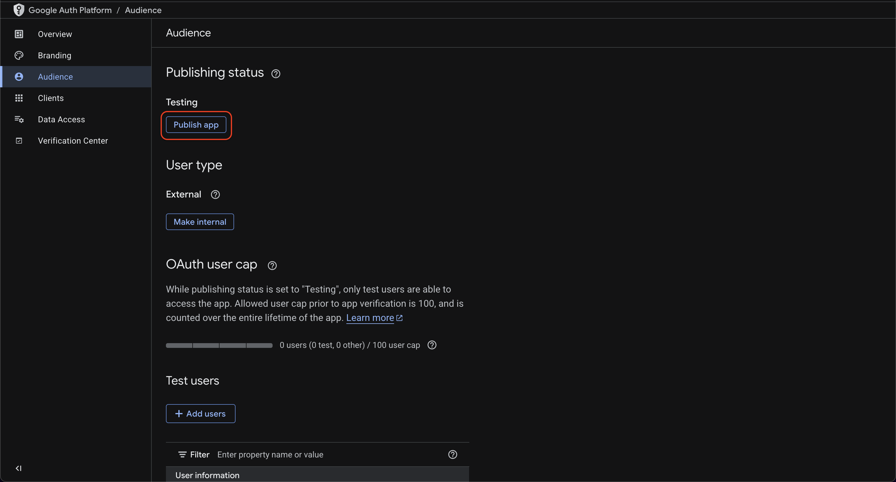
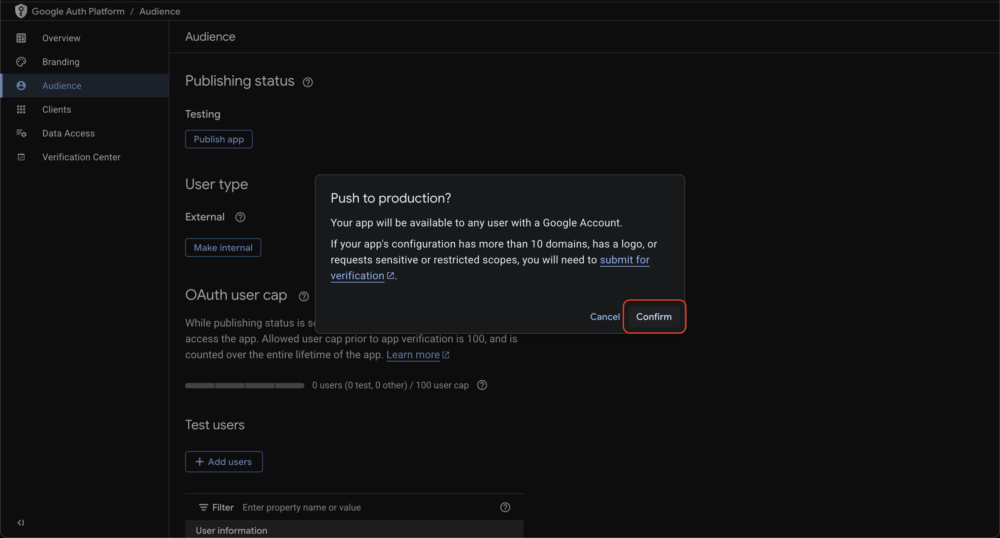

</div>
</details>


&nbsp;
## Deploy Resources
([return to top](#vertex-ai-agent-builder-answer-app))

The `install.sh` script automates the steps required to prepare the project and deploy the resources.
- Set the value of `loadbalancer_domain` in [`src/answer_app/config.yaml`](src/answer_app/config.yaml#L46) to a domain name you control or leave it set to `null` to use wildcard DNS from [`sslip.io`](https://sslip.io/). (Past versions of this repo used `nip.io` and some references to the service may remain.)
- Refer to the [Bootstrap](#bootstrap) and [Automate Deployments with Cloud Build](#automate-deployments-with-cloud-build) sections for details on individual steps.

Source the `install.sh` script to install the `answer-app`.
```sh
source scripts/install.sh # change the path if necessary
```


&nbsp;
## Update the OAuth client Authorized URIs
([return to top](#vertex-ai-agent-builder-answer-app))

Add the Terraform output value for `deployed_client_redirect_uri` as an authorized redirect URI in the "Answer App" Web application OAuth client.
- Terraform output values are displayed at the end of the Cloud Build logs.
- Display the specific output value:
```sh
(cd terraform/main && terraform output -raw "deployed_client_redirect_uri")
```

Example output:
```txt
https://35.244.148.105.sslip.io/oauth2callback
```
- Refer to the [Create an OAuth Client](#2-create-an-oauth-client) section to add the value to `URIs 2`.


&nbsp;
## Add an A record to the DNS Managed Zone
([return to top](#vertex-ai-agent-builder-answer-app))

**NOTE: You do not need to configure DNS if you set `loadbalancer_domain` to `null` in [`config.yaml`](src/answer_app/config.yaml) and instead used the default `sslip.io` domain.**
- Use the load balancer public IP address created by Terraform as the [A record in your DNS zone](https://cloud.google.com/load-balancing/docs/ssl-certificates/google-managed-certs#update-dns). Steps vary by DNS host/provider. ([Cloudflare example](https://developers.cloudflare.com/dns/zone-setups/full-setup/setup/))
- Disable any proxy for the A record to avoid SSL errors until Google validates the managed certificate domain. ([Cloudflare example](https://developers.cloudflare.com/dns/manage-dns-records/reference/proxied-dns-records/))


&nbsp;
## Enable Vertex AI Agent Builder
([return to top](#vertex-ai-agent-builder-answer-app))

A project Owner must [enable Vertex AI Agent Builder](https://cloud.google.com/generative-ai-app-builder/docs/before-you-begin#turn-on-discovery-engine) in the Cloud Console to use the Discovery Engine API and the Agent Builder console. It's a one-time setup to accept terms for the project for as long as the API remains enabled. (Checking the box to agree to model sampling is optional.)

<details>
<summary style="cursor: pointer; font-weight: bold; color: #8833c5;">
🖼️ Show/Hide Screenshots
</summary>

<div style="margin-top: 10px;">


</div>
</details>


&nbsp;
## Test the endpoint
([return to top](#vertex-ai-agent-builder-answer-app))

- A newly-created managed TLS certificate may take anywhere from 10-15 minutes up to 24 hours for the CA to sign [after DNS propagates](#add-an-a-record-to-the-dns-managed-zone).
- The Certificate [Managed status](https://cloud.google.com/load-balancing/docs/ssl-certificates/troubleshooting#certificate-managed-status) will change from PROVISIONING to ACTIVE when it's ready to use.
- Navigate to Network Services > Load balancing > select the load balancer > Frontend: Certificate > Select the certificate and wait for the status to change to ACTIVE.

<details>
<summary style="cursor: pointer; font-weight: bold; color: #8833c5;">
🖼️ Show/Hide Screenshots
</summary>

<div style="margin-top: 10px;">


</div>
</details>

- Alternatively you can check the status using [`gcloud` commands](https://cloud.google.com/load-balancing/docs/ssl-certificates/google-managed-certs#gcloud_1)
```sh
gcloud compute ssl-certificates list --global # list all certificates and get the **CERTIFICATE_NAME**

gcloud compute ssl-certificates describe **CERTIFICATE_NAME** --global --format="get(name,managed.status, managed.domainStatus)"
```
- When the certificate is in `ACTIVE` status, verify the endpoint is reachable using the `test_endpoint.sh` helper script.
    - The script [authenticates](https://cloud.google.com/run/docs/authenticating/service-to-service) using a service account and the [Cloud Run custom audience](https://cloud.google.com/run/docs/configuring/custom-audiences) to [generate an ID token](https://cloud.google.com/docs/authentication/get-id-token#impersonation)

```sh
scripts/test_endpoint.sh # change the path if necessary
```

- The server responds with a 200 status code and `{"status":"ok"}` if the endpoint is reachable and the TLS certificate is active.
- *It may take some more time after the certificate reaches ACTIVE Managed status before the endpoint responds with success. It may throw an SSLError due to mismatched client and server protocols until changes propagate.*
    - Example errors:
      - `curl: (35) LibreSSL/3.3.6: error:1404B410:SSL routines:ST_CONNECT:sslv3 alert handshake failure`
      - `curl: (35) LibreSSL SSL_connect: SSL_ERROR_SYSCALL in connection to 34.117.145.180.nip.io:443`


&nbsp;
## Import documents
([return to top](#vertex-ai-agent-builder-answer-app))

- Refer to the Vertex AI Agent Builder Data Store documentation to [prepare data for ingestion](https://cloud.google.com/generative-ai-app-builder/docs/prepare-data).
- [cloud-samples-data/gen-app-builder/search/cymbal-bank-employee](https://console.cloud.google.com/storage/browser/cloud-samples-data/gen-app-builder/search/cymbal-bank-employee)


&nbsp;
## Configure Identity-Aware Proxy
([return to top](#vertex-ai-agent-builder-answer-app))

**Reference:** [Enable IAP for Cloud Run](https://cloud.google.com/iap/docs/enabling-cloud-run)

1. Search for Identity-Aware Proxy (or "IAP") in the Console.

2. Toggle on IAP protection **ONLY** for the `answer-app-client` backend service (and not for the `answer-app` backend). You will be prompted to review configuration requirements, and then select the checkbox confirming your understanding and select "Turn On."
    - Application Backend Services may show an Error status when IAP is not enabled.
    - Users don't directly access the `answer-app` Backend Service. Instead, it enforces [authentication from the calling service](https://cloud.google.com/run/docs/authenticating/service-to-service) - the client app in this case. **An IAP Error status will not affect access to the `answer-app` Backend Service.**

<details>
<summary style="cursor: pointer; font-weight: bold; color: #8833c5;">
🖼️ Show/Hide Screenshots
</summary>

<div style="margin-top: 10px;">


</div>
</details>

3. Add a Google Identity (i.e a user or group) with the "IAP-secured Web App User" role.
    - See the [Known Issues](#errors-adding-users-to-identity-aware-proxy) section for information about "Policy updated failed" errors due to the [Domain restricted sharing Org policy](https://cloud.google.com/resource-manager/docs/organization-policy/restricting-domains#example_error_message).

4. You may see an "Error: Forbidden" message for about the first 5 minutes, but after that users with the "IAP-secured Web App User" role on the Project or IAP backend service should be able to access the app via the domain on the Load Balancer certificate.
    - i.e. `https://app.example.com` or `https://35.244.148.105.sslip.io`


&nbsp;
## Use the app
([return to top](#vertex-ai-agent-builder-answer-app))

Terraform deploys a `streamlit` [web client](src/client/streamlit_app.py) to Cloud Run that's accessible via the load balancer domain.
- Get the client app URL from Terraform output.(It's in the format `https://<load_balancer_domain>`)
```sh
cd terraform/main # change the path if necessary
terraform output client_app_uri
```

Example output:
```
"https://34.8.148.243.sslip.io"
```

- Open the URL in a web browser to access the client app.
On Mac or Linux, you can use the `open` command.
```sh
cd terraform/main # change the path if necessary
/usr/bin/open -a "/Applications/Google Chrome.app" $(terraform output -raw client_app_uri)
```

- Use the web client to send questions to the `answer-app` endpoint and view the generative answers.
- Hover over the inline citations to view details about the source document chunks used to generate the answer.
- Click on inline citations or the links in the Citations footer to view the source documents in a new tab.


&nbsp;
# UNINSTALL
([return to top](#vertex-ai-agent-builder-answer-app))

The `uninstall.sh` script destroys all Terraform-provisioned infrastructure and removes project prerequisites by calling the [`un_bootstrap.sh` script](#un-bootstrap). 


Source the `uninstall.sh` script to remove all `answer-app` resources from the project.
```sh
source scripts/uninstall.sh # change the path if necessary
```


&nbsp;
# TESTS

## Unit Tests
([return to top](#vertex-ai-agent-builder-answer-app))

Run `pytest` using `poetry`.

**NOTE**: The tests will fail if you've used the [Helper Scripts](#helper-scripts) to set the environment variables. Open a new shell session with a clean environment to run the tests.

1. [Install Poetry](https://python-poetry.org/docs/#installation)

2. [Install dependencies](https://python-poetry.org/docs/basic-usage/#installing-dependencies).
```sh
cd answer-app # the root of the repository where this README and the pyproject.toml file is located - change the path if necessary
poetry install
```

3. Run the tests.
```sh
poetry run pytest
```

4. Optionally run `pytest` with `coverage` and view the report.
```sh
poetry run coverage run -m pytest
poetry run coverage report -m
```

&nbsp;
## Run locally
([return to top](#vertex-ai-agent-builder-answer-app))

### Setup
- Complete the [User Account and Local Development Environment](#1-user-account-and-local-development-environment) steps to configure `gcloud`.
- [Set environment variables]((#2-set-environment-variables)).
```sh
source scripts/set_variables.sh # change the path if necessary
```
- Install Poetry and the project dependencies (see [Unit Tests](#unit-tests)).
- Ensure the `client_secret` JSON file downloaded from the [OAuth web client in the Cloud Console](#2-create-an-oauth-client) is in the `.streamlit/secrets` directory.
- Write a local `.streamlit/secrets/secrets.toml` file (ignored by the local .gitignore) by running the `write_secrets` script with `poetry`.
    ```sh
    poetry run write_secrets
    ```

### Run with Poetry
#### `answer-app`
- The service will listen on local port 8888.
```sh
poetry run uvicorn main:app --app-dir src/answer_app --reload --host localhost --port 8888
```

#### `client`
- With the environment variables set using the [`set_variables.sh` script](#2-set-environment-variables), the `client` app automatically gets and impersonated ID token for the Terraform service account on behalf of the user and sets the target audience for requests to `localhost:8888`.
- To solve unexpected communication issues, restart a fresh shell session to clear the environment, then re-source the `set_variables.sh` script.
```sh
poetry run streamlit run src/client/streamlit_app.py 
```

&nbsp;
### Build with Docker
#### `answer-app`
- Uses the `Dockerfile` in the root of the repo
```sh
docker build -t local-answer-app:0.1.0 -f ./src/answer_app/Dockerfile . # change image name and tag as needed
```

#### `client`
- Uses a `Dockerfile` in the `src/client` directory
```sh
docker build -t local-answer-app-client:0.1.0 -f ./src/client/Dockerfile . # change image name tag as needed
```

&nbsp;
### Run with Docker
- Use `--rm` to remove the container when it exits.
- Use `-v` to mount the host's `gcloud` configuration directory to the container's `/root/.config/gcloud` directory to allow the app to use [Application Default Credentials](https://stackoverflow.com/questions/38938216/pass-google-default-application-credentials-in-local-docker-run) for authentication.
- Use `-e` to set container environment variables for the [Google Cloud project](https://stackoverflow.com/questions/74866327/oserror-whilst-trying-to-run-a-python-app-inside-a-docker-container-using-appl), log level, target service account, and audience.
- Use `-p` to map the container's port 8080 to the host's port 8888 or 8080 (specify port mapping as `-p <host-port>:<container-port>`).
- The `$PROJECT` and `$TF_VAR_terraform_service_account` environment variables will already be set after you ran the [`set_variables.sh`](#2-set-environment-variables) script.

#### `answer-app`
Map container port 8080 to localhost:8888
```sh
docker run --rm -v $HOME/.config/gcloud:/root/.config/gcloud \
-e GOOGLE_CLOUD_PROJECT=$PROJECT \
-e LOG_LEVEL=DEBUG \
-p 8888:8080 local-answer-app:0.1.2 # change image name and tag as needed
```

#### `client`: call local backend
Map container port 8080 to localhost:8080 and call the **LOCAL** `answer-app` service at localhost:8888
```sh
docker run --rm -v $HOME/.config/gcloud:/root/.config/gcloud \
-e GOOGLE_CLOUD_PROJECT=$PROJECT \
-e LOG_LEVEL=DEBUG \
-e "TF_VAR_terraform_service_account=$TF_VAR_terraform_service_account" \
-p 8080:8080 local-answer-app-client:0.1.0 # change env vars and image name and tag as needed
```
- Open your browser to `http://localhost:8080`.
```sh
open -a "/Applications/Google Chrome.app" http://localhost:8080
```

#### `client`: call deployed backend
Map container port 8080 to localhost:8080 and call the **DEPLOYED** `answer-app` service at `https://app.mydomain.com/answer-app`
- To target the deployed `answer-app` backend service, set the `AUDIENCE` environment variable to the custom audience for the `answer-app` service (see [Use the Helper Scripts](#3-use-the-helper-scripts)).
- **NOTE**: You may want to unset the `AUDIENCE` environment variable after testing the deployed service if you want to continue local-only testing afterward.
```sh
source scripts/set_audience.sh # change the path if necessary
docker run --rm -v $HOME/.config/gcloud:/root/.config/gcloud \
-e GOOGLE_CLOUD_PROJECT=$PROJECT \
-e LOG_LEVEL=DEBUG \
-e "TF_VAR_terraform_service_account=$TF_VAR_terraform_service_account" \
-e "AUDIENCE=$AUDIENCE" \
-p 8080:8080 local-answer-app-client:0.1.0 # change env vars and image name and tag as needed
```
- Open your browser to `http://localhost:8080`.
```sh
open -a "/Applications/Google Chrome.app" http://localhost:8080
```

&nbsp;
### Debug a container
- Open a `sh` shell in the container image.
```sh
docker run --entrypoint /bin/sh --rm -it local-answer-app-client:0.1.0 # change image name and tag as needed
```

&nbsp;
# KNOWN ISSUES

## Installation fails service account impersonation
([return to top](#vertex-ai-agent-builder-answer-app))
### Problem
During the first installation while the `install.sh` script calls the `bootstrap.sh` script, it fails with the message: "ERROR: The caller cannot impersonate the service account and access objects in the bucket after 1 minute."

Example:
```
IAM POLICY PROPAGATION:

Waiting for the IAM policy to propagate...
Waiting for the IAM policy to propagate...
Waiting for the IAM policy to propagate...
Waiting for the IAM policy to propagate...
Waiting for the IAM policy to propagate...
Waiting for the IAM policy to propagate...

ERROR: The caller cannot impersonate the service account and access objects in the bucket after 1 minute.

ERROR: The bootstrap script failed.
```

The error occurs because the script tests the caller's permission to impersonate the Terraform service account before the IAM policy has fully propagated. The script retries for 1 minute and then fails.

### Solution
Re-run the `install.sh` script after a couple minutes to allow more time for the IAM policy to propagate. You can safely retry the script multiple times to allow more time for propagation.


&nbsp;
## Failure to create the Artifact Registry repository
([return to top](#vertex-ai-agent-builder-answer-app))
### Problem
When running the `bootstrap` module, Terraform fails to create the Artifact Registry repository.

Example:
```
╷
│ Error: Error creating Repository: googleapi: Error 403: Permission 'artifactregistry.repositories.create' denied on resource '//artifactregistry.googleapis.com/projects/my-project-id/locations/us-central1' (or it may not exist).
│ Details:
│ [
│   {
│     "@type": "type.googleapis.com/google.rpc.ErrorInfo",
│     "domain": "artifactregistry.googleapis.com",
│     "metadata": {
│       "permission": "artifactregistry.repositories.create",
│       "resource": "projects/my-project-id/locations/us-central1"
│     },
│     "reason": "IAM_PERMISSION_DENIED"
│   }
│ ]
│ 
│   with google_artifact_registry_repository.cloud_run,
│   on main.tf line 38, in resource "google_artifact_registry_repository" "cloud_run":
│   38: resource "google_artifact_registry_repository" "cloud_run" {
│ 
╵
```

The error occurs on the first run of the `bootstrap` module due to a race condition between the Artifact Registry API activation and applying the Terraform plan. The API activation can take a few minutes to complete.

### Solution
Rerun the `bootstrap.sh` script or manually re-apply the `bootstrap` module configuration.


&nbsp;
## Cloud Build fails with a Cloud Storage 403 permission denied error
([return to top](#vertex-ai-agent-builder-answer-app))
### Problem
Cloud Build fails with a `storage.objects.get` access error when trying to access the Google Cloud Storage object after the first run of the `bootstrap` module.

Example:
```
> gcloud builds submit . --config=cloudbuild.yaml --project=$PROJECT --region=$REGION --impersonate-service-account=$TF_VAR_terraform_service_account --verbosity=error --substitutions="_RUN_TYPE=apply"
Creating temporary archive of 25 file(s) totalling 650.8 KiB before compression.
Uploading tarball of [.] to [gs://my-project-id_cloudbuild/source/1732724661.794156-c07691d9db7449499595855914578017.tgz]
ERROR: (gcloud.builds.submit) INVALID_ARGUMENT: could not resolve source: googleapi: Error 403: run-app-cloudbuild@my-project-id.iam.gserviceaccount.com does not have storage.objects.get access to the Google Cloud Storage object. Permission 'storage.objects.get' denied on resource (or it may not exist)., forbidden
```

The error can occur shortly after setting up a new project with the `bootstrap` module for the first time. It's a race condition where the Cloud Build service account IAM role bindings have not yet propagated.

### Solution
Rerun the Cloud Build job to resolve the error.


&nbsp;
## Error creating a DataStore (named DataStore being deleted)
([return to top](#vertex-ai-agent-builder-answer-app))

### Problem
When re-running the Terraform configuration after deleting the DataStore, the following error occurs:
```
╷
│ Error: Error creating DataStore: googleapi: Error 400: DataStore projects/.../locations/global/collections/default_collection/dataStores/cymbal-bank-data-store is being deleted, please wait for deletion to complete before recreating with the same ID. The deletion could take a couple of hours.
│ 
│   with module.answer_app.google_discovery_engine_data_store.layout_parser_data_store["answer-app-default"],
│   on ../modules/answer-app/discoveryengine.tf line 1, in resource "google_discovery_engine_data_store" "layout_parser_data_store":
│    1: resource "google_discovery_engine_data_store" "layout_parser_data_store" {
│ 
╵
```

### Solution
Choose one of the following solutions:
- Wait for the DataStore deletion to complete before re-running the Terraform configuration.
- Change the DataStore ID in the Terraform configuration to create a new DataStore. Re-apply Terraform.


&nbsp;
## Errors adding users to Identity-Aware Proxy
([return to top](#vertex-ai-agent-builder-answer-app))
### Problem
When [adding members to the IAP-secured backend service](#configure-identity-aware-proxy), a [Domain restricted sharing Org policy](https://cloud.google.com/resource-manager/docs/organization-policy/restricting-domains) causes an error message like this:\
\

### Solution
1. [Edit the policy](https://cloud.google.com/resource-manager/docs/organization-policy/creating-managing-policies#creating_and_editing_policies) to temporarily disable it.
2. Add the members to IAP-protected backend service IAM policy.
3. Re-enable the policy.


&nbsp;
## Errors reading or editing Terraform resources
([return to top](#vertex-ai-agent-builder-answer-app))
### Problem
Intermittent connectivity issues (for example, while using a VPN) can cause unresponsiveness during `plan` or `apply` operations.

Example:
```
│ Error: Error when reading or editing RedisInstance "projects/my-project/locations/us-central1/instances/my-redis-instance": Get "https://redis.googleapis.com/v1/projects/my-project/locations/us-central1/instances/my-redis-instance?alt=json": write tcp [fe80::ca4b:d6ff:fec7:8a11%utun1]:59235->[2607:f8b0:4009:809::200a]:443: write: socket is not connected
│ 
│   with google_redis_instance.default,
│   on redis.tf line 79, in resource "google_redis_instance" "default":
│   79: resource "google_redis_instance" "default" {
│ 
╵
```

### Solution
Retry the operation to clear the error. If the error persists, check your network or VPN connection and try again.


&nbsp;
## The Search Agent refuses to answer questions
([return to top](#vertex-ai-agent-builder-answer-app))

### Problem
- The Search agent responds with `"No results could be found. Try rephrasing the search query."` when the query is valid and should be answerable from the data store documents.
- Cloud Run logs do not include citations or references for the answer response.
- The Big Query `answer-app.conversations` table includes `null` values for the `answer.citations`, `answer.references`, or `answer.related_questions` columns.
- The Big Query `answer-app.conversations` table might list some but not all of the documents expected to be returned in the search results.
- The search preview in the Vertex AI Agent Builder console also does not return any results.
- The data store documents appear to be properly imported with no errors in the Vertex AI Agent Builder console.

### Solution
Importing documents using the [refresh options](https://cloud.google.com/generative-ai-app-builder/docs/refresh-data) without first purging the data store in separate step may result in this issue. The import operation may actually not have imported and indexed the documents properly. [Purge the data store](https://cloud.google.com/generative-ai-app-builder/docs/delete-datastores) and re-import the documents to resolve the issue.


&nbsp;
## Failure to remove regional backends
([return to top](#vertex-ai-agent-builder-answer-app))

### Problem
Terraform fails to remove the regional backend Network Endpoint Groups connected to the backend service. It will throw a 'resource in use by another resource' error.

### Solution
Apply changes in multiple steps to remove the regional backends:
1. Edit the backend service to include only the default regional backend group.
    - Change line 95 in `terraform/modules/answer-app/cloudrun.tf` (`module.answer-app.google_compute_backend_service.run_app`) from
    ```
    group = google_compute_region_network_endpoint_group.run_app[backend.key].id
    ```
    to
    ```
    group = google_compute_region_network_endpoint_group.run_app[var.region].id
    ```
2. Apply the changes to update the backend service while leaving the `additional_regions` variable list full with the backends you wish to later remove.
3. Remove the regions you want to destroy from the `additional_regions` list variable.
4. Apply the changes to remove the regional backend NEGs and their associated Cloud Run Services.
5. Revert the change to Change line 95 in `terraform/modules/answer-app/cloudrun.tf` back to `group = google_compute_region_network_endpoint_group.run_app[backend.key].id` and apply the changes to confirm the configuration works.


&nbsp;
# REFERENCE INFORMATION


## Answer Method Configuration Options (Python)
([return to top](#vertex-ai-agent-builder-answer-app))

The Discovery Engine API [`answer` method](https://cloud.google.com/generative-ai-app-builder/docs/answer) accepts a variety of configuration options to customize the search and answer generation phases. The following Python code snippet demonstrates how to configure the `answer` method with the available options.

The [Python client library](https://cloud.google.com/python/docs/reference/discoveryengine/latest) does not currently implement all of the features available in the [RPC API](https://cloud.google.com/python/docs/reference/discoveryengine/latest). ([`SafetySetting`](https://cloud.google.com/generative-ai-app-builder/docs/reference/rpc/google.cloud.discoveryengine.v1#safetysetting), for [example](https://cloud.google.com/python/docs/reference/discoveryengine/latest/google.cloud.discoveryengine_v1.types.AnswerQueryRequest.SafetySpec))

<details><summary>Click to expand</summary>

```py
async def answer_query(
    self,
    query_text: str,
    session_id: str | None,
) -> AnswerQueryResponse:
    """Call the answer method and return a generated answer and a list of search results,
    with links to the sources.

    Args:
        query_text (str): The text of the query to be answered.
        session_id (str, optional): The session ID to continue a conversation.

    Returns:
        AnswerQueryResponse: The response from the Conversational Search Service,
        containing the generated answer and selected references.

    Refs:
    https://cloud.google.com/generative-ai-app-builder/docs/answer#search-answer-basic
    https://cloud.google.com/python/docs/reference/discoveryengine/latest/google.cloud.discoveryengine_v1.types.AnswerQueryRequest
    """
    # serving_config.
    engine = f"projects/{self._project_id}/locations/{self._location}/collections/default_collection/engines/{self._engine_id}"
    serving_config = f"{engine}/servingConfigs/default_serving_config"

    # Query: accepts one of `text` or `query_id`.
    query = discoveryengine.Query(text=query_text)
    # query = discoveryengine.Query(query_id="query_id")

    # session - construct the name using the engine as the serving config.
    session = f"{engine}/sessions/{session_id}" if session_id else None

    # SafetySpec - options for search phase.
    safety_spec = discoveryengine.AnswerQueryRequest.SafetySpec(enable=False)

    # RelatedQuestionsSpec.
    related_questions_spec = discoveryengine.AnswerQueryRequest.RelatedQuestionsSpec(enable=False)

    # AnswerGenerationSpec - options for answer phase.
    answer_generation_spec = discoveryengine.AnswerQueryRequest.AnswerGenerationSpec(
        model_spec=discoveryengine.AnswerQueryRequest.AnswerGenerationSpec.ModelSpec(
            model_version="gemini-1.5-flash-001/answer_gen/v2",
        ),
        prompt_spec=discoveryengine.AnswerQueryRequest.AnswerGenerationSpec.PromptSpec(
            preamble=self._preamble,
        ),
        include_citations=True,
        answer_language_code="en",
        ignore_adversarial_query=False,
        ignore_non_answer_seeking_query=False,
        ignore_low_relevant_content=False,  # Optional: Return fallback answer when content is not relevant
        ignore_jail_breaking_query=False,
    )

    # SearchSpec - options for search phase.
    search_spec = discoveryengine.AnswerQueryRequest.SearchSpec(
        # one of `search_params` or `search_result_list` must be set.
        search_params=discoveryengine.AnswerQueryRequest.SearchSpec.SearchParams(
            max_return_results=10,
            filter="filter_expression",
            boost_spec=discoveryengine.SearchRequest.BoostSpec(
                condition_boost_specs=[
                    discoveryengine.SearchRequest.BoostSpec.ConditionBoostSpec(
                        condition="condition_1",
                        boost=0.0,
                        boost_control_spec=discoveryengine.SearchRequest.BoostSpec.ConditionBoostSpec.BoostControlSpec(
                            field_name="boost_field_1",
                            # select one attribute_type
                            attribute_type=discoveryengine.SearchRequest.BoostSpec.ConditionBoostSpec.BoostControlSpec.AttributeType.ATTRIBUTE_TYPE_UNSPECIFIED,
                            # attribute_type=discoveryengine.SearchRequest.BoostSpec.ConditionBoostSpec.BoostControlSpec.AttributeType.NUMERICAL,
                            # attribute_type=discoveryengine.SearchRequest.BoostSpec.ConditionBoostSpec.BoostControlSpec.AttributeType.FRESHNESS,
                            # select one interpolation_type
                            interpolation_type=discoveryengine.SearchRequest.BoostSpec.ConditionBoostSpec.BoostControlSpec.InterpolationType.INTERPOLATION_TYPE_UNSPECIFIED,
                            # interpolation_type=discoveryengine.SearchRequest.BoostSpec.ConditionBoostSpec.BoostControlSpec.InterpolationType.LINEAR,
                            control_points=[
                                discoveryengine.SearchRequest.BoostSpec.ConditionBoostSpec.BoostControlSpec.ControlPoint(
                                    attribute_value="value_1",
                                    boost_amount=0.0,
                                ),
                                discoveryengine.SearchRequest.BoostSpec.ConditionBoostSpec.BoostControlSpec.ControlPoint(
                                    attribute_value="value_2",
                                    boost_amount=0.0,
                                ),
                            ],
                        ),
                    ),
                    discoveryengine.SearchRequest.BoostSpec.ConditionBoostSpec(
                        condition="condition_2",
                        boost=0.0,
                        boost_control_spec=discoveryengine.SearchRequest.BoostSpec.ConditionBoostSpec.BoostControlSpec(
                            field_name="boost_field_2",
                            # select one attribute_type
                            attribute_type=discoveryengine.SearchRequest.BoostSpec.ConditionBoostSpec.BoostControlSpec.AttributeType.ATTRIBUTE_TYPE_UNSPECIFIED,
                            # attribute_type=discoveryengine.SearchRequest.BoostSpec.ConditionBoostSpec.BoostControlSpec.AttributeType.NUMERICAL,
                            # attribute_type=discoveryengine.SearchRequest.BoostSpec.ConditionBoostSpec.BoostControlSpec.AttributeType.FRESHNESS,
                            # select one interpolation_type
                            interpolation_type=discoveryengine.SearchRequest.BoostSpec.ConditionBoostSpec.BoostControlSpec.InterpolationType.INTERPOLATION_TYPE_UNSPECIFIED,
                            # interpolation_type=discoveryengine.SearchRequest.BoostSpec.ConditionBoostSpec.BoostControlSpec.InterpolationType.LINEAR,
                            control_points=[
                                discoveryengine.SearchRequest.BoostSpec.ConditionBoostSpec.BoostControlSpec.ControlPoint(
                                    attribute_value="value_1",
                                    boost_amount=0.0,
                                ),
                                discoveryengine.SearchRequest.BoostSpec.ConditionBoostSpec.BoostControlSpec.ControlPoint(
                                    attribute_value="value_2",
                                    boost_amount=0.0,
                                ),
                            ],
                        ),
                    ),
                ],
            ),
            order_by="field_name_for_ordering",
            # select one search_result_mode
            search_result_mode=discoveryengine.SearchRequest.ContentSearchSpec.SearchResultMode.DOCUMENTS,
            # search_result_mode=discoveryengine.SearchRequest.ContentSearchSpec.SearchResultMode.SEARCH_RESULT_MODE_UNSPECIFIED,
            # search_result_mode=discoveryengine.SearchRequest.ContentSearchSpec.SearchResultMode.CHUNKS,
            data_store_specs=[
                discoveryengine.SearchRequest.DataStoreSpec(
                    data_store="projects/{project}/locations/{location}/collections/{collection_id}/dataStores/{data_store_id}",
                    filter="filter_expression",
                )
            ],
        ),
        # search_result_list=discoveryengine.AnswerQueryRequest.SearchSpec.SearchResultList(
        #     search_results=[
        #         discoveryengine.AnswerQueryRequest.SearchSpec.SearchResultList.SearchResult(
        #             unstructured_document_info=discoveryengine.AnswerQueryRequest.SearchSpec.SearchResultList.SearchResult.UnstructuredDocumentInfo(
        #                 document="document_resource_name",
        #                 uri="document_uri",
        #                 title="document_title",
        #                 document_contexts=[
        #                     discoveryengine.AnswerQueryRequest.SearchSpec.SearchResultList.SearchResult.UnstructuredDocumentInfo.DocumentContext(
        #                         page_identifier="page_identifier",
        #                         content="content",
        #                     ),
        #                     discoveryengine.AnswerQueryRequest.SearchSpec.SearchResultList.SearchResult.UnstructuredDocumentInfo.DocumentContext(
        #                         page_identifier="page_identifier",
        #                         content="content",
        #                     ),
        #                 ],
        #                 extractive_segments=[
        #                     # Guide <https://cloud.google.com/generative-ai-app-builder/docs/snippets#extractive-segments>
        #                     discoveryengine.AnswerQueryRequest.SearchSpec.SearchResultList.SearchResult.UnstructuredDocumentInfo.ExtractiveSegment(
        #                         page_identifier="page_identifier",
        #                         content="content",
        #                     ),
        #                     discoveryengine.AnswerQueryRequest.SearchSpec.SearchResultList.SearchResult.UnstructuredDocumentInfo.ExtractiveSegment(
        #                         page_identifier="page_identifier",
        #                         content="content",
        #                     ),
        #                 ],
        #                 extractive_answers=[
        #                     # Guide <https://cloud.google.com/generative-ai-app-builder/docs/snippets#get-answers>
        #                     discoveryengine.AnswerQueryRequest.SearchSpec.SearchResultList.SearchResult.UnstructuredDocumentInfo.ExtractiveAnswer(
        #                         page_identifier="page_identifier",
        #                         content="content",
        #                     ),
        #                     discoveryengine.AnswerQueryRequest.SearchSpec.SearchResultList.SearchResult.UnstructuredDocumentInfo.ExtractiveAnswer(
        #                         page_identifier="page_identifier",
        #                         content="content",
        #                     ),
        #                 ],
        #             ),
        #             chunk_info=discoveryengine.AnswerQueryRequest.SearchSpec.SearchResultList.SearchResult.ChunkInfo(
        #                 chunk="chunk_resource_name",
        #                 content="chunk_content",
        #                 document_metadata=discoveryengine.AnswerQueryRequest.SearchSpec.SearchResultList.SearchResult.ChunkInfo.DocumentMetadata(
        #                     uri="document_uri",
        #                     title="document_title",
        #                 ),
        #             ),
        #         ),
        #         discoveryengine.AnswerQueryRequest.SearchSpec.SearchResultList.SearchResult(
        #             unstructured_document_info=discoveryengine.AnswerQueryRequest.SearchSpec.SearchResultList.SearchResult.UnstructuredDocumentInfo(
        #                 document="document_resource_name",
        #                 uri="document_uri",
        #                 title="document_title",
        #                 document_contexts=[
        #                     discoveryengine.AnswerQueryRequest.SearchSpec.SearchResultList.SearchResult.UnstructuredDocumentInfo.DocumentContext(
        #                         page_identifier="page_identifier",
        #                         content="content",
        #                     ),
        #                     discoveryengine.AnswerQueryRequest.SearchSpec.SearchResultList.SearchResult.UnstructuredDocumentInfo.DocumentContext(
        #                         page_identifier="page_identifier",
        #                         content="content",
        #                     ),
        #                 ],
        #                 extractive_segments=[
        #                     # Guide <https://cloud.google.com/generative-ai-app-builder/docs/snippets#extractive-segments>
        #                     discoveryengine.AnswerQueryRequest.SearchSpec.SearchResultList.SearchResult.UnstructuredDocumentInfo.ExtractiveSegment(
        #                         page_identifier="page_identifier",
        #                         content="content",
        #                     ),
        #                     discoveryengine.AnswerQueryRequest.SearchSpec.SearchResultList.SearchResult.UnstructuredDocumentInfo.ExtractiveSegment(
        #                         page_identifier="page_identifier",
        #                         content="content",
        #                     ),
        #                 ],
        #                 extractive_answers=[
        #                     # Guide <https://cloud.google.com/generative-ai-app-builder/docs/snippets#get-answers>
        #                     discoveryengine.AnswerQueryRequest.SearchSpec.SearchResultList.SearchResult.UnstructuredDocumentInfo.ExtractiveAnswer(
        #                         page_identifier="page_identifier",
        #                         content="content",
        #                     ),
        #                     discoveryengine.AnswerQueryRequest.SearchSpec.SearchResultList.SearchResult.UnstructuredDocumentInfo.ExtractiveAnswer(
        #                         page_identifier="page_identifier",
        #                         content="content",
        #                     ),
        #                 ],
        #             ),
        #             chunk_info=discoveryengine.AnswerQueryRequest.SearchSpec.SearchResultList.SearchResult.ChunkInfo(
        #                 chunk="chunk_resource_name",
        #                 content="chunk_content",
        #                 document_metadata=discoveryengine.AnswerQueryRequest.SearchSpec.SearchResultList.SearchResult.ChunkInfo.DocumentMetadata(
        #                     uri="document_uri",
        #                     title="document_title",
        #                 ),
        #             ),
        #         ),
        #     ]
        # ),
    )

    # QueryUnderstandingSpec - options for query phase.
    query_understanding_spec = discoveryengine.AnswerQueryRequest.QueryUnderstandingSpec(
        query_classification_spec=discoveryengine.AnswerQueryRequest.QueryUnderstandingSpec.QueryClassificationSpec(
            types=[
                discoveryengine.AnswerQueryRequest.QueryUnderstandingSpec.QueryClassificationSpec.Type.TYPE_UNSPECIFIED,
                discoveryengine.AnswerQueryRequest.QueryUnderstandingSpec.QueryClassificationSpec.Type.ADVERSARIAL_QUERY,
                discoveryengine.AnswerQueryRequest.QueryUnderstandingSpec.QueryClassificationSpec.Type.NON_ANSWER_SEEKING_QUERY,
                discoveryengine.AnswerQueryRequest.QueryUnderstandingSpec.QueryClassificationSpec.Type.JAIL_BREAKING_QUERY,
                discoveryengine.AnswerQueryRequest.QueryUnderstandingSpec.QueryClassificationSpec.Type.NON_ANSWER_SEEKING_QUERY_V2,
            ]
        ),
        query_rephraser_spec=discoveryengine.AnswerQueryRequest.QueryUnderstandingSpec.QueryRephraserSpec(
            disable=False,
            max_rephrase_steps=1, # max allowed is 5 steps
        ),
        
    )

    # user_pseudo_id.
    user_pseudo_id = "user_pseudo_id"

    # user_labels.
    user_labels = {"key": "value"}

    # Initialize request argument(s).
    request = discoveryengine.AnswerQueryRequest(
        serving_config=serving_config,
        query=query,
        session=session,
        safety_spec=safety_spec,
        related_questions_spec=related_questions_spec,
        answer_generation_spec=answer_generation_spec,
        search_spec=search_spec,
        query_understanding_spec=query_understanding_spec,
        user_pseudo_id=user_pseudo_id,
        user_labels=user_labels,
    )

    # Make the request.
    response = await self._client.answer_query(request)

    # Handle the response.
    logger.debug(response)
    logger.info(f"Answer: {response.answer.answer_text}")

    return response
```
</details>


&nbsp;
## Helper Scripts
([return to top](#vertex-ai-agent-builder-answer-app))

Shell scripts in the `terraform/scripts` directory automate common tasks.
- `install.sh`: Deploy the resources for the `answer-app` service. (Combines other scripts to set up the project and deploy the resources.)
- `bootstrap.sh`: Prepare the target deployment project. (Used by the `install.sh` script.)
- `set_audience.sh`: Set the custom audience used to call the `answer-app` service. (Used by the `test_endpoint.sh` script.)
- `set_token.sh`: Set the ID token used to call the `answer-app` service. (Used by the `test_endpoint.sh` script.)
- `set_variables.sh`: Set the environment variables for the shell session. (Used by the `bootstrap.sh`, `set_audience.sh`, `un_bootstrap.sh`, and `uninstall.sh` scripts and by Cloud Build.). Variables:
  - `PROJECT`: The Google Cloud project ID.
  - `REGION`: The default compute region.
  - `BUCKET`: The staging bucket for Vertex AI Data Store documents.
  - `TF_VAR_project_id`: The Google Cloud project ID for Terraform. (Automatically read by Terraform.)
  - `TF_VAR_terraform_service_account`: The Terraform service account email address. (Automatically read by Terraform.)
- `terraform_service_account_roles.txt`: The IAM roles granted to the Terraform service account. (Used by the `bootstrap.sh` script.)
- `test_endpoint.sh`: Test the `answer-app` endpoint with a `curl` request.
- `un_bootstrap.sh`: Remove the resources created by the `bootstrap.sh` script. (Used by the `uninstall.sh` script.)
- `uninstall.sh`: Remove the `answer-app` resources from the project. (Combines other scripts to remove the resources and clean up the project.)


&nbsp;
## Bootstrap
([return to top](#vertex-ai-agent-builder-answer-app))

The `bootstrap.sh` script automates the `gcloud` and `terraform` commands required to prepare the project.
- Source the `set_variables.sh` script to configure the shell environment, including [Terraform environment variables](https://developer.hashicorp.com/terraform/language/values/variables#environment-variables). (Used automatically by later Terraform commands.).
- Enable the Service Usage, IAM, and Service Account Credentials APIs.
- Create a service account for Terraform provisioning.
- Grant the required [IAM roles](https://cloud.google.com/iam/docs/understanding-roles) to the service account.
- Prepare [Service Account Impersonation](https://cloud.google.com/iam/docs/service-account-impersonation) for the caller's user account.
- Create a Terraform [remote state](https://developer.hashicorp.com/terraform/language/state/remote) bucket.
- Initialize the Terraform `bootstrap` module and apply to provision resources required for the main module:
  - Project APIs.
  - Cloud Build service account.
  - Artifact Registry repository.
  - IAM role bindings for the Cloud Build service account:
      - Project IAM policy: Cloud Build Service Account (`roles/cloudbuild.builds.builder`) role.
      - Terraform service account IAM policy: Service Account Token Creator (`roles/iam.serviceAccountTokenCreator`) role.

Source the `bootstrap.sh` script to set your shell variables and run the Terraform commands.
```sh
source scripts/bootstrap.sh # change the path if necessary
```


&nbsp;
## Automate Deployments with Cloud Build
([return to top](#vertex-ai-agent-builder-answer-app))

Use [`gcloud builds submit`](https://cloud.google.com/build/docs/running-builds/submit-build-via-cli-api) with [build config files](https://cloud.google.com/build/docs/configuring-builds/create-basic-configuration) to plan and deploy project resources.

### 1. Set configuration values in `config.yaml`.
Verify/Change parameters as needed:
- [`config.yaml`](src/answer_app/config.yaml)
- Refer to [Connect cloud run services to an existing load balancer](#connect-cloud-run-services-to-an-existing-load-balancer) for configuration requirements when using a Load Balancer managed outside of this Terraform configuration.

### 2. Set environment variables.
Source the `set_variables.sh` script to configure the shell environment if you restarted your shell session or made changes to the environment variables.
- The `bootstrap.sh` script sources this file to set the environment variables and it's not necessary to run it again in the same shell session.
```sh
source scripts/set_variables.sh # change the path if necessary
```

### 3. Build & push the docker images and apply the Terraform configuration
Use `gcloud` to submit the build from the `answer-app` root directory (the location of this README file) as the build context.
- [OPTIONAL] Omit the `_RUN_TYPE=apply` substitution to run a plan-only build and review the Terraform changes before applying.
```sh
cd /path/to/answer-app # replace with the local system path to the answer-app root directory
gcloud builds submit . --config=cloudbuild.yaml --project=$PROJECT --region=$REGION --substitutions="_RUN_TYPE=apply"
```

- Review the build logs in the [Cloud Build History](https://cloud.google.com/build/docs/view-build-results) to verify the build and deployment status.


&nbsp;
## Connect cloud run services to an existing load balancer
([return to top](#vertex-ai-agent-builder-answer-app))

Edit and verify these files to connect the Cloud Run services to an existing load balancer.

### [`config.yaml`](src/answer_app/config.yaml#L42)
- Set `create_loadbalancer = false` **AND** set `loadbalancer_domain` to the value of the existing load balancer domain.

### [`cloudrun.tf`](terraform/modules/answer-app/cloudrun.tf#L87)
- Ensure the Terraform `cloud-run` module resource `google_compute_backend_service.run_app` argument [`load_balancing_scheme`](https://registry.terraform.io/providers/hashicorp/google/latest/docs/resources/compute_backend_service#load_balancing_scheme) matches the existing [load balancer type](https://cloud.google.com/load-balancing/docs/backend-service).
  - Use `load_balancing_scheme = "EXTERNAL_MANAGED"` for the Global external Application Load Balancer.
  - Use `load_balancing_scheme = "EXTERNAL"` for the Classic Application Load Balancer.
- Cloud Run services will use the load balancer domain in the custom audience for authentication.
- You must connect the backend services to the existing load balancer outside of this repo's Terraform configuration.


&nbsp;
## Rollbacks
([return to top](#vertex-ai-agent-builder-answer-app))

### Option 1: Use the Cloud Console to switch Cloud Run service traffic to a different revision
#### **THIS WILL CHANGE STATE OUTSIDE OF TERRAFORM CONTROL**
- Navigate to the Cloud Run service in the Cloud Console.
- Click the 'Revisions' tab.
- Click 'MANAGE TRAFFIC'.
- Select the target revision and traffic percentage (100% to rollback completely to another revision).
- Click 'SAVE'.

### Option 2: Rollback to a different Docker image using Terraform
- Identify the rollback target Docker image.
- Pass the target image name and tag to the `docker_image` [input variable](https://developer.hashicorp.com/terraform/language/values/variables#assigning-values-to-root-module-variables) in the `main` root module.
    - Use a `.tfvars` file, the `-var` command line argument, or the `TF_VAR_` [environment variable](https://developer.hashicorp.com/terraform/language/values/variables#environment-variables).
- Apply the Terraform configuration to update the Cloud Run service to the rollback target.

#### Example: select an image by digest or tag from Artifact Registry.
1. Source the `set_variables.sh` script to configure the shell environment (provides variables including `PROJECT` and `BUCKET`). Refer to the [Prerequisites](#prerequisites) section for details on configuring the `gcloud` CLI.
```sh
source scripts/set_variables.sh # change the path if necessary
```

2. Initialize the Terraform `main` module configuration with the remote state by passing required arguments to the [partial backend configuration](https://developer.hashicorp.com/terraform/language/settings/backends/configuration#partial-configuration).
    - See the [Terraform Backends](#terraform-backends) section for more information.
    - You might need to [reconfigure the backend](#reconfiguring-a-backend) if you've already initialized the module.
```sh
cd terraform/main # change the path if necessary
terraform init -backend-config="bucket=$BUCKET" -backend-config="impersonate_service_account=$TF_VAR_terraform_service_account" -reconfigure
```

3. Set the Terraform input environment variable `TF_VAR_docker_image` to the target image names.
    - The variable value is a JSON object with key-value pairs for each service name and corresponding image name.
    - Don't include spaces or line breaks in the JSON string when setting this environment variable.
    - This example uses the tag Terraform adds to image names corresponding to the Cloud Build ID.
    - You can also use the image digest, e.g., `us-central1-docker.pkg.dev/my-project-id/answer-app/answer-app@sha256:4f2092b926b7e9dc30813e819bb86cfa7d664eede575539460b4a68bbd4981e1`.
```sh
export TF_VAR_docker_image='{"answer-app":"us-central1-docker.pkg.dev/my-project-id/answer-app/answer-app:50bde371-76f8-452a-8a17-9b63273f13e0"}'
```

- Apply the Terraform configuration to update the Cloud Run service to the target image.
```sh
terraform apply
```


&nbsp;
## Execute Terraform to apply infrastructure-only changes to the `bootstrap` or `main` module.
([return to top](#vertex-ai-agent-builder-answer-app))

Applying the resources from the `bootstrap` module is a one-time setup for a new project. You can re-run it, for example, to add or enable additional APIs to support future development. You can apply infrastructure-only changes to the `main` module to update cloud resources without rebuilding the Docker images (and without using Cloud Build). If you don't provide docker image names as input variables, the `main` retrieves the last-deployed Docker images from the module state and reuses them in the Cloud Run services.

1. Source the `set_variables.sh` script to configure the shell environment (provides variables including `PROJECT` and `BUCKET`). Refer to the [Prerequisites](#prerequisites) section for details on configuring the `gcloud` CLI.
```sh
source scripts/set_variables.sh # change the path if necessary
```

2. Initialize the Terraform `main` or `bootstrap` module using a [partial backend configuration](https://developer.hashicorp.com/terraform/language/settings/backends/configuration#partial-configuration).
    - See the [Terraform Backends](#terraform-backends) section for more information.
    - You might need to [reconfigure the backend](#reconfiguring-a-backend) if you've already initialized the module.
```sh
cd terraform/main # or cd terraform/bootstrap, change the path if necessary
terraform init -backend-config="bucket=$BUCKET" -backend-config="impersonate_service_account=$TF_VAR_terraform_service_account" -reconfigure
```

3. Apply the Terraform configuration to provision the cloud resources.
```sh
terraform apply
```


&nbsp;
## Un-Bootstrap
([return to top](#vertex-ai-agent-builder-answer-app))

<span style="color: red;">**WARNING: THIS WILL DELETE YOUR TERRAFORM STATE**</span>

The `un_bootstrap.sh` script automates `gcloud` commands to remove these project resources created by the `bootstrap` script. It does not disable any APIs. 
- Terraform state bucket
- Terraform service account project role bindings
- Terraform service account resource

Source the `un_bootstrap.sh` script to remove the resources.
```sh
source scripts/un_bootstrap.sh # change the path if necessary
```


&nbsp;
## [Service account impersonation](https://cloud.google.com/iam/docs/service-account-impersonation)
([return to top](#vertex-ai-agent-builder-answer-app))

Instead of creating and managing Service Account keys for authentication, this code uses an [impersonation pattern for Terraform](https://cloud.google.com/blog/topics/developers-practitioners/using-google-cloud-service-account-impersonation-your-terraform-code) to fetch access tokens on behalf of a Google Cloud IAM Service Account.

- Grant the caller (a Google user account or group address) permission to generate [short-lived access tokens](https://cloud.google.com/iam/docs/create-short-lived-credentials-direct) on behalf of the targeted service account.
    - The caller needs the Account Token Creator role (`roles/iam.serviceAccountTokenCreator`) or a custom role with the `iam.serviceAccounts.getAccessToken` permission that applies to the Terraform provisioning service account.
    - Create a [role binding on the Service Account resource](https://cloud.google.com/iam/docs/manage-access-service-accounts#single-role) instead of the project IAM policy to [minimize the scope of the permission](https://cloud.google.com/iam/docs/best-practices-service-accounts#project-folder-grants).
    - Perhaps counterintuitively, the primitive Owner role (`roles/owner`) does NOT include this permission.
```sh
export MEMBER='user:{your-username@example.com}' # replace '{your-username@example.com}' from 'user:{your-username@example.com}' with your Google user account email address
# Example to add a group -> export MEMBER='group:devops-group@example.com'

gcloud iam service-accounts add-iam-policy-binding "terraform-service-account@${PROJECT}.iam.gserviceaccount.com" --member=$MEMBER --role="roles/iam.serviceAccountTokenCreator" --condition=None
```
- Use the `google_service_account_access_token` [Terraform data source](https://registry.terraform.io/providers/hashicorp/google/latest/docs/data-sources/service_account_access_token) to generate short-lived credentials [instead of service account keys](https://cloud.google.com/iam/docs/best-practices-for-managing-service-account-keys#alternatives).


&nbsp;
# Terraform Overview
([return to top](#vertex-ai-agent-builder-answer-app))
General instructions to initialize a Terraform workspace/environment and set up a backend configuration and bucket for storing Terraform state.


- [Initialize](#initialize)
- [Workspaces](#workspaces)
- [Terraform Backends](#terraform-backends)
- [Flexible Backends - Partial Configuration](#flexible-backends---partial-configuration)
- [Reconfiguring a Backend](#reconfiguring-a-backend)
- [Plan and Apply](#plan-and-apply)


## Initialize
([return to Terraform Overview](#terraform-overview))

The Terraform working directory must be [initialized](https://developer.hashicorp.com/terraform/cli/init) to set up configuration files and download provider plugins.
```sh
# Initialize the working directory.
terraform init
```

## Workspaces
([return to Terraform Overview](#terraform-overview))

[Terraform workspaces](https://developer.hashicorp.com/terraform/cli/workspaces) allow separation of environments so each is managed in a unique state file.

```sh
# View the active and available workspaces (Terraform starts with only the 'default' workspace).
terraform workspace list

# Set an environment variable for the deployment environment/workspace name.
export ENVIRONMENT='sandbox'

# Create an environment-specific workspace.
terraform workspace new $ENVIRONMENT

# Choose a workspace.
terraform workspace select default

# Select a workspace or create it if it doesn't exist.
terraform workspace select -or-create nonprod
```

## Terraform Backends
([return to Terraform Overview](#terraform-overview))

Using the [default (local) backend](https://developer.hashicorp.com/terraform/language/backend#default-backend) doesn't require additional configuration. A [Cloud Storage backend](https://developer.hashicorp.com/terraform/language/backend/gcs) requires these prerequisites:
- The GCS backend bucket must already exist - Terraform will not create it at `init`.
Example (edit with your actual project and bucket name):
```sh
gcloud storage buckets create gs://my-terraform-bucket --project=my-project --uniform-bucket-level-access
```
- The caller or impersonated service account needs permission to read and write to the bucket.
- Define a GCS backend in the `terraform.backend` block.

```terraform
terraform {
  backend "gcs" {
    bucket                      = "my-terraform-bucket"
    impersonate_service_account = "terraform-service-account@my-project-id..iam.gserviceaccount.com"
    prefix                      = "terraform_state/"
  }
  required_providers {
    google = {
      source  = "hashicorp/google"
      version = "5.25.0"
    }
  }
  required_version = ">= 0.13"
}
```

## Flexible Backends - Partial Configuration
([return to Terraform Overview](#terraform-overview))

- Backend declaration can't accept input variables or use expansion/interpolation because Terraform loads the backend config before anything else.
- A [partial configuration](https://developer.hashicorp.com/terraform/language/backend#partial-configuration) in the `terraform.backend` block allows flexible backend definition for multiple environments.
- Partial configurations allow you to include some attributes in the `terraform.backend` block and pass the rest from another source.
- Options for supplying backend configuration arguments include a file, command-line key/value arguments, [environment variables](https://developer.hashicorp.com/terraform/cli/config/environment-variables), or interactive prompts.
- Define the remaining backend details in a dedicated `*.gcs.tfbackend` file, i.e. `backend_sandbox.gcs.tfbackend` and pass it's path as a command-line argument to separate backends per environment. (Hashicorp docs recommend a `*.backendname.tfbackend` naming convention, but Terraform will accept any correctly-formatted file. IDE syntax highlighting and linting might not pick up `.tfbackend` files.)

### Partial backend configuration example:
`backend.tf`:
```hcl
terraform {
  backend "gcs" {
    prefix = "bootstrap"
  }
  required_providers {
    google = {
      source  = "hashicorp/google"
      version = ">=5.25.0"
    }
  }
  required_version = ">= 0.13"
}

```

- Example 1 - initialize a partial backend using an environment-specific backend configuration file:
```sh
# Create a workspace-specific backend configuration file for the Google Cloud Storage backend.
cat << EOF > backend_$ENVIRONMENT.gcs.tfbackend
bucket                      = "terraform-state-my-project-id"
impersonate_service_account = "terraform-service-account@my-project-id.iam.gserviceaccount.com"
EOF

# Initialize the remote state
terraform init -backend-config="backend_$ENVIRONMENT.gcs.tfbackend"
```

- Example 2 - initialize a partial backend using command-line arguments:
```sh
terraform init -backend-config="bucket=terraform-state-my-project-id" -backend-config="impersonate_service_account=terraform-service-account@my-project-id.iam.gserviceaccount.com"
```


## Reconfiguring a Backend
([return to Terraform Overview](#terraform-overview))

To force Terraform to use a new backend without [migrating](https://spacelift.io/blog/terraform-migrate-state) state data from an existing backend, [initialize](https://developer.hashicorp.com/terraform/cli/commands/init#backend-initialization) with the `-reconfigure` flag. The existing state in the old backend is left unchanged and not copied to the new backend.
```sh
terraform init -reconfigure -backend-config="backend_$ENVIRONMENT.gcs.tfbackend
```

## Plan and Apply
([return to Terraform Overview](#terraform-overview))

Terraform requires declared or default values for [input variables](https://developer.hashicorp.com/terraform/language/values/variables#assigning-values-to-root-module-variables). For example, variables defined in `.tfvars` files to separate environments.

```sh
# Define environment-specific variables in a .tfvars file
cat << EOF > vars_$ENVIRONMENT.tfvars
project_id                = "my-project"
terraform_service_account = "terraform-sa@my-project.iam.gserviceaccount.com"
terraform_bucket_name     = "my-terraform-bucket"
region                    = "us-central1"
zone                      = "us-central1-a"
EOF

# View the Terraform plan.
terraform plan -var-file="vars_$ENVIRONMENT.tfvars"

# Apply changes.
terraform apply -var-file="vars_$ENVIRONMENT.tfvars"

```
