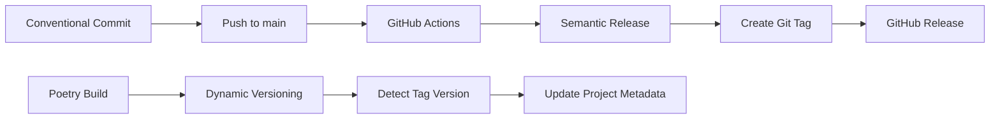

# Version Management

[← Back to README](../../README.md)

## Overview

This project implements a fully automated version management system using **semantic-release** for tag creation and **poetry-dynamic-versioning** for version synchronization. This dual-plugin approach ensures zero manual version maintenance while supporting Poetry's build system requirements.

## Architecture

### Dual-Plugin System

The version management system consists of two complementary plugins:

1. **[Python Semantic Release](https://python-semantic-release.readthedocs.io/)** - Creates Git tags and GitHub releases based on conventional commits
2. **[Poetry Dynamic Versioning](https://pypi.org/project/poetry-dynamic-versioning/)** - Automatically detects version from Git tags during builds

### How It Works



1. **Developer commits** using conventional commit format
2. **GitHub Actions triggers** on push to main branch
3. **Semantic-release analyzes** commits and creates version tags
4. **GitHub releases** are auto-generated with changelog
5. **Poetry-dynamic-versioning** detects tags during builds and updates project metadata

## Configuration

### Current Configuration

**pyproject.toml:**
```toml
[project]
name = "answer-app"
dynamic = []  # Auto-formatted, but dynamic versioning still works via build backend

[build-system]
requires = ["poetry-core>=2.0.0,<3.0.0", "poetry-dynamic-versioning>=1.5.0,<2.0.0"]
build-backend = "poetry_dynamic_versioning.backend"  # This enables dynamic versioning

[tool.poetry]
# Poetry section (version auto-managed by build backend)

[tool.poetry-dynamic-versioning]
enable = true
vcs = "git"
style = "semver"

[tool.semantic_release]
upload_to_pypi = false    # No PyPI publishing
upload_to_release = false # No build artifacts in releases
tag_format = "v{version}"
commit = false           # No version bump commits (respects protected branches)
tag = true              # Create Git tags
vcs_release = true      # Create GitHub releases
```

### Key Design Decisions

- **No version commits**: `commit = false` prevents commits to protected main branch
- **No build artifacts**: `upload_to_release = false` creates clean releases without distribution files  
- **Dynamic versioning backend**: `poetry_dynamic_versioning.backend` handles version detection from Git tags
- **Automatic version detection**: Versions determined from Git tags during build/package operations
- **SemVer style**: Standard semantic versioning format (MAJOR.MINOR.PATCH)
- **Clone-and-use workflow**: Optimized for direct repository cloning rather than package installation

## Conventional Commits

### Commit Message Format

The project follows [Conventional Commits](https://www.conventionalcommits.org/) specification:

```
<type>[optional scope]: <description>

[optional body]

[optional footer(s)]
```

### Version Bump Rules

- **Major version bump** (1.0.0 → 2.0.0): Breaking changes with `BREAKING CHANGE:` in footer
- **Minor version bump** (1.0.0 → 1.1.0): New features with `feat:` prefix
- **Patch version bump** (1.0.0 → 1.0.1): Bug fixes with `fix:` or `perf:` prefix

### Supported Commit Types

| Type | Description | Version Impact |
|------|-------------|----------------|
| `feat:` | New features | Minor bump |
| `fix:` | Bug fixes | Patch bump |
| `perf:` | Performance improvements | Patch bump |
| `docs:` | Documentation changes | No bump |
| `style:` | Code style changes | No bump |
| `refactor:` | Code refactoring | No bump |
| `test:` | Test changes | No bump |
| `build:` | Build system changes | No bump |
| `ci:` | CI configuration changes | No bump |
| `chore:` | Other changes | No bump |

## Automated Process

### GitHub Actions Workflow

The release workflow (`.github/workflows/release.yml`) automatically:

1. **Runs tests** to ensure code quality
2. **Analyzes commit messages** to determine version bump
3. **Creates semantic version tags** (e.g., `v0.2.0`)
4. **Generates GitHub releases** with auto-generated changelog
5. **Respects branch protection** by not pushing commits

### What Gets Updated Automatically

When a release is triggered:

- ✅ **Git tag created** (e.g., `v0.2.0`)
- ✅ **GitHub release published** with auto-generated changelog
- ✅ **Version badges** in README.md automatically reflect latest GitHub release
- ✅ **Project metadata** dynamically reflects current version during builds

### What Does NOT Get Updated

- ❌ **No version commits** to pyproject.toml (by design)
- ❌ **No manual file updates** required
- ❌ **No CI commits** cluttering git history
- ❌ **No build artifacts** attached to releases (optimized for direct cloning)

## Manual Operations

### Safe Local Testing

**Commands that DON'T modify pyproject.toml:**
```bash
# Normal development - no file changes
poetry install
poetry run pytest  
poetry run uvicorn main:app
poetry version  # Shows detected version safely
```

**Commands that DO modify pyproject.toml:**
```bash
# These require cleanup before committing
poetry run poetry-dynamic-versioning
poetry build
```

**Safe testing pattern:**
```bash
# Save current state
git stash push pyproject.toml

# Test dynamic versioning  
poetry run poetry-dynamic-versioning
# Review output...

# Restore clean state
git stash pop
```

### Check Next Version (Dry Run)

```bash
poetry run semantic-release version --dry-run
```

### Force Version Creation

```bash
poetry run semantic-release version
```

### Check Current Dynamic Version

```bash
poetry run poetry-dynamic-versioning
```

⚠️ **Important**: This command modifies `pyproject.toml` by writing the detected version. After testing, revert changes before committing:

```bash
# After testing, revert any version writes:
git checkout pyproject.toml

# Or use git stash to save/restore:
git stash push pyproject.toml
poetry run poetry-dynamic-versioning  # Test
git stash pop  # Restore original file
```

### Generate Changelog Only

```bash
poetry run semantic-release changelog
```

## Manual Override Options

### 1. Skip Automatic Release

Add `[skip ci]` to commit message:
```bash
git commit -m "docs: update README [skip ci]"
```

### 2. Force Specific Version Type

Use conventional commit footers:
```bash
git commit -m "fix: minor bug

BREAKING CHANGE: This forces a major version bump"
```

### 3. Manual Version Override

For emergency situations, you can manually create tags:
```bash
# Create tag manually
git tag v1.0.0
git push origin v1.0.0

# Create GitHub release manually
gh release create v1.0.0 --generate-notes
```

### 4. Disable Dynamic Versioning Temporarily

```bash
# Temporarily disable for development
export POETRY_DYNAMIC_VERSIONING_BYPASS=1
poetry build
```

## Release Packaging Options

### Current Configuration: Clone-and-Use Workflow

The current configuration is optimized for repositories that users clone and work with directly. This creates clean releases with tags and changelogs but without build artifacts.

**Benefits:**
- ✅ **Faster releases** - No build time required
- ✅ **Cleaner release pages** - No unnecessary files attached
- ✅ **Simpler workflow** - Users clone and `poetry install`
- ✅ **Reduced CI/CD complexity** - No build or upload steps

### Alternative: Package Distribution Workflow

If you later want to distribute pre-built packages (e.g., for `pip install` usage), you can enable build artifacts:

#### Option 1: GitHub Release Artifacts Only

```toml
[tool.semantic_release]
build_command = "pip install poetry && poetry build"
dist_path = "dist/"
upload_to_pypi = false
upload_to_release = true    # Enable build artifacts
remove_dist = false
tag_format = "v{version}"
commit = false
tag = true
vcs_release = true

[tool.semantic_release.publish]
dist_glob_patterns = ["dist/*"]
upload_to_vcs_release = true
```

**This creates:**
- Wheel files (`.whl`) for `pip install`
- Source distributions (`.tar.gz`) 
- Attached to GitHub releases as downloadable assets

#### Option 2: PyPI + GitHub Release Distribution

```toml
[tool.semantic_release]
build_command = "pip install poetry && poetry build"
dist_path = "dist/"
upload_to_pypi = true       # Enable PyPI publishing
upload_to_release = true    # Enable GitHub artifacts
remove_dist = false
tag_format = "v{version}"
commit = false
tag = true
vcs_release = true

[tool.semantic_release.publish]
dist_glob_patterns = ["dist/*"]
upload_to_vcs_release = true
```

**Additional requirements for PyPI:**
- Configure PyPI API token as `PYPI_TOKEN` secret in GitHub Actions
- Ensure package name is available on PyPI
- Add publication permissions to workflow

#### Option 3: PyPI Only (No GitHub Artifacts)

```toml
[tool.semantic_release]
build_command = "pip install poetry && poetry build"
dist_path = "dist/"
upload_to_pypi = true       # Enable PyPI publishing
upload_to_release = false   # No GitHub artifacts
remove_dist = true          # Clean up after upload
tag_format = "v{version}"
commit = false
tag = true
vcs_release = true
```

### When to Enable Package Distribution

Consider enabling package distribution when:

1. **External users** want to install via `pip install answer-app`
2. **Automated systems** need to install the package programmatically
3. **CI/CD pipelines** in other projects want to use your package as a dependency
4. **Docker images** need to install the package without cloning the repository
5. **Offline environments** need pre-built packages

### When to Keep Current Configuration

Keep the current clone-and-use configuration when:

1. **Development-focused** repository for direct collaboration
2. **Application deployments** using Docker or Cloud Run (current use case)
3. **Small team** working directly with source code
4. **Rapid iteration** without external package consumers
5. **Infrastructure projects** deployed from source

### Migration Path

To enable package distribution later:

1. **Update semantic-release configuration** in `pyproject.toml`
2. **Add PyPI token** as GitHub repository secret (if using PyPI)
3. **Update GitHub Actions workflow** permissions if needed
4. **Test with dry-run** to verify configuration
5. **Update documentation** to reflect new installation methods

### Build Artifact Contents

When enabled, semantic-release creates these files:

- **`dist/*.whl`** - Binary wheel distributions for faster installation
- **`dist/*.tar.gz`** - Source distributions with complete source code
- **Dependencies included** - All Poetry dependencies properly specified
- **Entry points configured** - CLI commands available after installation

The build process uses Poetry's native packaging system ensuring compatibility with the existing dependency management.

## Understanding Dynamic Versioning Behavior

### Expected Version Display

Dynamic versioning creates **different version outputs** depending on the command used:

#### What Shows `0.0.0` (Expected Behavior)

These commands read the static placeholder value from `pyproject.toml`:

```bash
poetry version          # Shows: 0.0.0
poetry install          # Shows: version 0.0.0 during installation
poetry show answer-app  # Shows: 0.0.0
```

**This is completely normal** - these commands read the `[tool.poetry] version = "0.0.0"` placeholder.

#### What Shows Actual Dynamic Version

To see the real version detected from Git tags:

```bash
poetry run poetry-dynamic-versioning
# Shows: 0.2.0-post.1+5d82d2a (example)
```

**Format explanation:**
- `0.2.0` - Base version from latest Git tag
- `-post.1` - One commit after the tag
- `+5d82d2a` - Short commit hash

#### When Dynamic Versioning Activates

Dynamic versions are automatically used during:
- ✅ **`poetry build`** - Creates packages with correct version
- ✅ **`pip install`** - Installs with dynamic version when built from source
- ✅ **Package metadata** - Runtime version detection in applications
- ✅ **CI/CD builds** - Automated builds use detected versions

#### Quick Reference

| Command | Version Shown | Explanation |
|---------|---------------|-------------|
| `poetry version` | 0.0.0 | Static placeholder (expected) |
| `poetry install` | 0.0.0 | Static placeholder (expected) |
| `poetry run poetry-dynamic-versioning` | 0.2.0-post.1+5d82d2a | Actual dynamic version |
| `poetry build` | 0.2.0-post.1+5d82d2a | Dynamic version in built package |

**💡 Remember**: Seeing `0.0.0` in routine commands is **correct behavior**, not a problem to fix.

## Troubleshooting

### Common Issues

#### 1. Understanding `0.0.0` Version Display

**⚠️ This is usually NOT a problem** - see [Expected Version Display](#expected-version-display) above.

**Symptoms**: `poetry version` or `poetry install` shows `0.0.0`

**Expected Behavior**: These commands read the static placeholder and should show `0.0.0`

**Only investigate if**:
- `poetry run poetry-dynamic-versioning` also shows `0.0.0`
- `poetry build` creates packages with version `0.0.0`

**Actual Problem Causes**:
- **No Git tags**: Ensure at least one semantic version tag exists (`git tag v0.1.0`)
- **Not in Git repository**: Dynamic versioning requires Git repository
- **Dirty working directory**: Commit or stash changes before building

**Debug Commands**:
```bash
# Check current Git tags
git tag --sort=-version:refname

# Test actual dynamic versioning (WARNING: modifies pyproject.toml)
git stash push pyproject.toml
poetry run poetry-dynamic-versioning
git stash pop

# Check if placeholder is correct (should show 0.0.0)
poetry version
```

#### 2. Semantic Release Not Creating Tags

**Symptoms**: Workflow succeeds but no tags/releases created

**Common Causes**:
- **No conventional commits**: Ensure commits follow `type:` format
- **Push disabled**: Check that `push = false` is not set in config
- **Permission issues**: Verify GitHub token has appropriate permissions

**Debug Steps**:
```bash
# Check what semantic-release would do
poetry run semantic-release version --dry-run

# Review recent commits
git log --oneline -5

# Check semantic-release configuration
poetry run semantic-release config
```

#### 3. GitHub Actions Permission Errors

**Symptoms**: `Error: Resource not accessible by integration`

**Solution**: Ensure workflow has appropriate permissions:
```yaml
permissions:
  contents: write
  id-token: write
```

#### 4. Semantic Release Workflow Fails

**Symptoms**: GitHub Actions workflow fails during semantic-release step

**Common Causes**:
- **Configuration errors**: Invalid `pyproject.toml` semantic-release settings
- **Permission issues**: Insufficient GitHub token permissions
- **Missing dependencies**: poetry-dynamic-versioning not installed

**Solution**: Verify minimal configuration:
```toml
[tool.semantic_release]
upload_to_pypi = false
upload_to_release = false
tag_format = "v{version}"
commit = false
tag = true
vcs_release = true
```

### Advanced Troubleshooting

#### Enable Verbose Logging

**GitHub Actions**: Add to workflow:
```yaml
- name: Python Semantic Release
  uses: python-semantic-release/python-semantic-release@v9.15.0
  with:
    root_options: "-vv"
```

**Local Testing**:
```bash
poetry run semantic-release -vv version --dry-run
```

#### Check Plugin Status

```bash
# Verify poetry-dynamic-versioning is installed
poetry show poetry-dynamic-versioning

# Check plugin configuration
poetry run poetry-dynamic-versioning --help
```

#### Version Detection Issues

```bash
# Test version detection manually
cd /path/to/repo
python -c "
import dunamai  # poetry-dynamic-versioning dependency
print(f'Detected version: {dunamai.Version.from_git().serialize()}')
"
```

## Integration with Cloud Build

To integrate semantic versioning with the existing Cloud Build pipeline:

### Option 1: Trigger on Tags

Configure Cloud Build to trigger on version tags:

```yaml
# cloudbuild.yaml
substitutions:
  _VERSION: ${TAG_NAME}
  
steps:
  - name: 'gcr.io/cloud-builders/docker'
    args: ['build', '-t', 'gcr.io/$PROJECT_ID/answer-app:${_VERSION}', '.']
```

### Option 2: Use Semantic Version in Docker Tags

Replace `$BUILD_ID` with semantic version:

```bash
# In Cloud Build step
export VERSION=$(git describe --tags --abbrev=0)
docker build -t gcr.io/$PROJECT_ID/answer-app:$VERSION .
```

## Examples

### Feature Release (Minor Version Bump)

```bash
git commit -m "feat: add user session management API endpoint"
# Pushes to main → Creates v0.3.0 tag → GitHub release generated
```

### Bug Fix (Patch Version Bump)

```bash
git commit -m "fix: resolve OAuth token refresh issue"
# Results in: v0.2.0 → v0.2.1
```

### Breaking Change (Major Version Bump)

```bash
git commit -m "feat: redesign API authentication

BREAKING CHANGE: OAuth flow now requires additional scope parameter"
# Results in: v0.2.0 → v1.0.0
```

### Multiple Changes in One Release

```bash
git commit -m "feat: add user metrics dashboard"
git commit -m "fix: resolve memory leak in background tasks"
git commit -m "docs: update API documentation"
# Results in minor version bump (highest precedence)
```

## Benefits

- ✅ **Zero manual version management** - Completely automated
- ✅ **Protected branch compatible** - No commits to main branch
- ✅ **Consistent versioning** - SemVer compliance guaranteed
- ✅ **Automatic changelogs** - Generated from conventional commits
- ✅ **GitHub integration** - Native release management
- ✅ **Build-time accuracy** - Dynamic version detection
- ✅ **CI/CD friendly** - Works with any build system
- ✅ **Audit trail** - Complete version history in Git tags

## Best Practices

1. **Write descriptive commit messages** following conventional commits
2. **Use appropriate commit types** for accurate version bumps
3. **Test locally with dry-run** before pushing important changes
4. **Keep commits atomic** - one logical change per commit
5. **Use breaking change footers** when introducing incompatible changes
6. **Review generated changelogs** for accuracy and completeness

## References

- [Python Semantic Release Documentation](https://python-semantic-release.readthedocs.io/)
- [Poetry Dynamic Versioning](https://pypi.org/project/poetry-dynamic-versioning/)
- [Conventional Commits Specification](https://www.conventionalcommits.org/)
- [Semantic Versioning](https://semver.org/)
- [GitHub Actions Documentation](https://docs.github.com/en/actions)