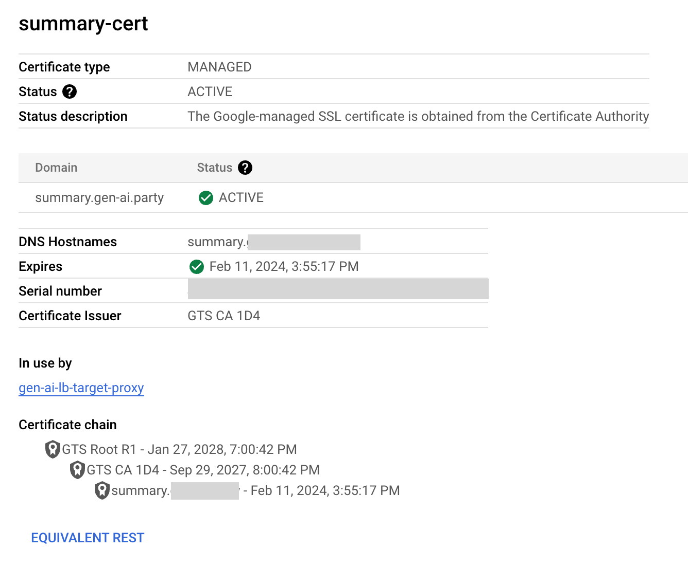

# Deployment Guide

## Prerequisites

- Your Google user account must be a [Project Owner](https://cloud.google.com/iam/docs/roles-overview#legacy-basic) in the target Google Cloud project.
- Choose one of the following options to install and configure [Terraform](https://developer.hashicorp.com/terraform) and the [`gcloud` CLI](https://cloud.google.com/sdk/gcloud) for your development environment:
    - Follow the instructions in [OPTION 1](#option-1-deploying-from-google-cloud-shell) to configure deployment using [Google Cloud Shell](https://cloud.google.com/shell/docs/using-cloud-shell).
    - Follow the instructions in [OPTION 2](#option-2-deploying-outside-of-google-cloud-shell) to configure deployment from your local terminal.

### OPTION 1: Deploying from Google Cloud Shell

Use [Cloud Shell](https://cloud.google.com/shell/docs/using-cloud-shell) for a convenient environment with `gcloud` and `terraform` pre-installed. Your user account (`core.account`) and default project (`core.project`) should already be set in the Cloud Shell environment.

1. Select your target deployment project in the [Cloud Console](https://console.cloud.google.com/projectselector2/home/dashboard).
2. [Open Cloud Shell](https://cloud.google.com/shell/docs/launching-cloud-shell) and confirm your `gcloud` configuration.
```sh
gcloud config list --format=yaml
```
Example output:
```yaml
accessibility:
  screen_reader: 'True'
component_manager:
  disable_update_check: 'True'
compute:
  gce_metadata_read_timeout_sec: '30'
core:
  account: project-owner@example.com
  disable_usage_reporting: 'False'
  project: my-project-id
metrics:
  environment: devshell
```

3. Optionally, set the default compute region (`compute.region`). The helper script will default to `us-central1` if your `gcloud` configuration does not specify a region.
    - Agree to enable the `compute.googleapis.com` API if prompted.
```sh
gcloud config set compute/region 'region' # replace with your preferred region, e.g. us-central1
```

4. Set any other [configuration values](https://cloud.google.com/sdk/gcloud/reference/config/set) as needed.

5. Consider using Personal Access Tokens (PATs) to [clone the `answer-app` repo](https://docs.github.com/en/github/authenticating-to-github/keeping-your-account-and-data-secure/creating-a-personal-access-token) as an alternative to managing SSH keys in Cloud Shell.

### OPTION 2: Deploying outside of Google Cloud Shell

1. Install [Terraform](https://learn.hashicorp.com/tutorials/terraform/install-cli).
2. Install the [Google Cloud SDK](https://cloud.google.com/sdk/docs/install).
3. Authenticate.
```sh
gcloud auth login
```

4. Set the target deployment project as your default.
```sh
gcloud config set project 'my-project-id' # replace with your project ID
```

5. Configure [Application Default Credentials (ADC)](https://cloud.google.com/docs/authentication/application-default-credentials) for local development.
```sh
gcloud auth application-default login
```

6. Optionally, set the default compute region (`compute.region`). The helper script will default to `us-central1` if your `gcloud` configuration does not specify a region.
    - Agree to enable the `compute.googleapis.com` API if prompted.
```sh
gcloud config set compute/region 'region' # replace with your preferred region, e.g. 'us-central1'
```

7. [Clone the repository](https://docs.github.com/en/repositories/creating-and-managing-repositories/cloning-a-repository) and open a terminal session in the repo root (`answer-app`) directory.

## Deploy Resources

The `install.sh` script automates the steps required to prepare the project and deploy the resources.

- Set the value of `loadbalancer_domain` in [`src/answer_app/config.yaml`](../../src/answer_app/config.yaml#L46) to a domain name you control or leave it set to `null` to use wildcard DNS from [`sslip.io`](https://sslip.io/). (Past versions of this repo used `nip.io` and some references to the service may remain.)
- Refer to the [Bootstrap](../terraform/bootstrap.md) and [Cloud Build](../terraform/cloud-build.md) sections for details on individual steps.

Source the `install.sh` script to install the `answer-app`:
```sh
source scripts/install.sh # change the path if necessary
```

## Post-Deployment Steps

### Add DNS A Record

**NOTE: You do not need to configure DNS if you set `loadbalancer_domain` to `null` in [`config.yaml`](../../src/answer_app/config.yaml) and instead used the default `sslip.io` domain.**

- Use the load balancer public IP address created by Terraform as the [A record in your DNS zone](https://cloud.google.com/load-balancing/docs/ssl-certificates/google-managed-certs#update-dns). Steps vary by DNS host/provider. ([Cloudflare example](https://developers.cloudflare.com/dns/zone-setups/full-setup/setup/))
- Disable any proxy for the A record to avoid SSL errors until Google validates the managed certificate domain. ([Cloudflare example](https://developers.cloudflare.com/dns/manage-dns-records/reference/proxied-dns-records/))

### Enable Vertex AI Agent Builder

A project Owner must [enable Vertex AI Agent Builder](https://cloud.google.com/generative-ai-app-builder/docs/before-you-begin#turn-on-discovery-engine) in the Cloud Console to use the Discovery Engine API and the Agent Builder console. It's a one-time setup to accept terms for the project for as long as the API remains enabled. (Checking the box to agree to model sampling is optional.)

<details>
<summary style="cursor: pointer; font-weight: bold; color: #8833c5;">
🖼️ Show/Hide Screenshots
</summary>

<div style="margin-top: 10px;">


</div>
</details>

### Test the Endpoint

- A newly-created managed TLS certificate may take anywhere from 10-15 minutes up to 24 hours for the CA to sign [after DNS propagates](#add-dns-a-record).
- The Certificate [Managed status](https://cloud.google.com/load-balancing/docs/ssl-certificates/troubleshooting#certificate-managed-status) will change from PROVISIONING to ACTIVE when it's ready to use.
- Navigate to Network Services > Load balancing > select the load balancer > Frontend: Certificate > Select the certificate and wait for the status to change to ACTIVE.

<details>
<summary style="cursor: pointer; font-weight: bold; color: #8833c5;">
🖼️ Show/Hide Screenshots
</summary>

<div style="margin-top: 10px;">



</div>
</details>

- Alternatively you can check the status using [`gcloud` commands](https://cloud.google.com/load-balancing/docs/ssl-certificates/google-managed-certs#gcloud_1)
```sh
gcloud compute ssl-certificates list --global # list all certificates and get the **CERTIFICATE_NAME**
gcloud compute ssl-certificates describe **CERTIFICATE_NAME** --global # check status
```

Use the helper script to test that the backend is responding to requests:
```sh
scripts/test_endpoint.sh # change the path if necessary
```

### Import Documents

Follow the instructions to [add an unstructured data source](https://cloud.google.com/generative-ai-app-builder/docs/create-datastore-ingest) to the Vertex AI Agent Builder Search app.

### Configure Identity-Aware Proxy

**Reference:** [Enable IAP for Cloud Run](https://cloud.google.com/iap/docs/enabling-cloud-run)

1. Search for Identity-Aware Proxy (or "IAP") in the Console.

2. Toggle on IAP protection **ONLY** for the `answer-app-client` backend service (and not for the `answer-app` backend). You will be prompted to review configuration requirements, and then select the checkbox confirming your understanding and select "Turn On."
    - Application Backend Services may show an Error status when IAP is not enabled.
    - Users don't directly access the `answer-app` Backend Service. Instead, it enforces [authentication from the calling service](https://cloud.google.com/run/docs/authenticating/service-to-service) - the client app in this case. **An IAP Error status will not affect access to the `answer-app` Backend Service.**

<details>
<summary style="cursor: pointer; font-weight: bold; color: #8833c5;">
🖼️ Show/Hide Screenshots
</summary>

<div style="margin-top: 10px;">


</div>
</details>

3. Add a Google Identity (i.e a user or group) with the "IAP-secured Web App User" role.
    - See the [Known Issues](../troubleshooting/known-issues.md#errors-adding-users-to-identity-aware-proxy) section for information about "Policy updated failed" errors due to the [Domain restricted sharing Org policy](https://cloud.google.com/resource-manager/docs/organization-policy/restricting-domains#example_error_message).

4. You may see an "Error: Forbidden" message for about the first 5 minutes, but after that users with the "IAP-secured Web App User" role on the Project or IAP backend service should be able to access the app via the domain on the Load Balancer certificate.
    - i.e. `https://app.example.com` or `https://35.244.148.105.sslip.io`

## Use the App

Navigate to the client app URI. Use this command to view the URI:
```sh
terraform output client_app_uri
```

Example output:
```
"https://34.8.148.243.sslip.io"
```

- Open the URL in a web browser to access the client app.
- Use IAP to sign in with any Google identity that you've granted the "IAP-secured Web App User" role.
- Ask questions about documents you've imported into the Vertex AI Agent Builder Search app.