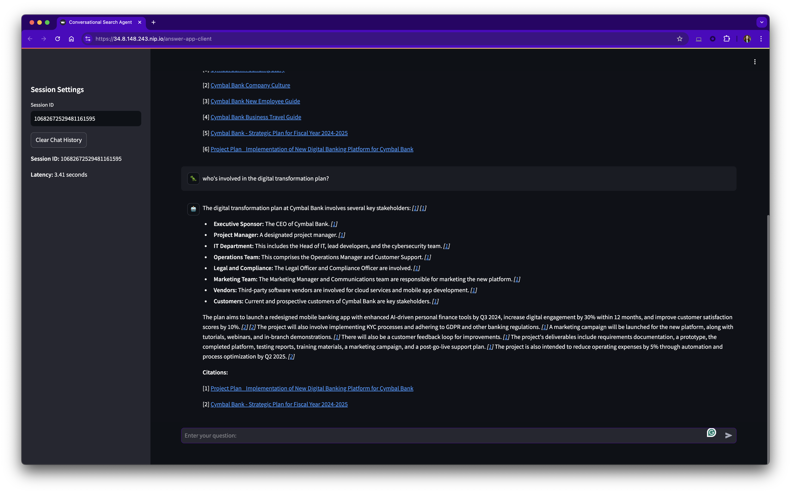

# Deployment Guide

[← Back to README](../../README.md)

## Deploy Resources

The `install.sh` script automates the steps required to prepare the project and deploy the resources.

- Set the value of `loadbalancer_domain` in [`src/answer_app/config.yaml`](../../src/answer_app/config.yaml#L46) to a domain name you control or leave it set to `null` to use wildcard DNS from [`sslip.io`](https://sslip.io/). (Past versions of this repo used `nip.io` and some references to the service may remain.)
- Refer to the [Bootstrap](../infrastructure/bootstrap.md) and [Cloud Build](../infrastructure/cloud-build.md) sections for details on individual steps.

Source the `install.sh` script to install the `answer-app`:
```sh
source scripts/install.sh # change the path if necessary
```

## Post-Deployment Steps

### Update the OAuth client Authorized URIs

Refer to the OAuth Setup guide [Post-deployment](../installation/oauth-setup.md#5-post-deployment-update-oauth-client-authorized-uris) section.

### Add DNS A Record

**NOTE: You do not need to configure DNS if you set `loadbalancer_domain` to `null` in [`config.yaml`](../../src/answer_app/config.yaml) and instead used the default `sslip.io` domain.**

- Use the load balancer public IP address created by Terraform as the [A record in your DNS zone](https://cloud.google.com/load-balancing/docs/ssl-certificates/google-managed-certs#update-dns). Steps vary by DNS host/provider. ([Cloudflare example](https://developers.cloudflare.com/dns/zone-setups/full-setup/setup/))
- Disable any proxy for the A record to avoid SSL errors until Google validates the managed certificate domain. ([Cloudflare example](https://developers.cloudflare.com/dns/manage-dns-records/reference/proxied-dns-records/))

### Enable Vertex AI Agent Builder

A project Owner must [enable Vertex AI Agent Builder](https://cloud.google.com/generative-ai-app-builder/docs/before-you-begin#turn-on-discovery-engine) in the Cloud Console to use the Discovery Engine API and the Agent Builder console. It's a one-time setup to accept terms for the project for as long as the API remains enabled. (Checking the box to agree to model sampling is optional.)

<details>
<summary style="cursor: pointer; font-weight: bold; color: #8833c5;">
🖼️ Show/Hide Screenshots
</summary>

<div style="margin-top: 10px;">


</div>
</details>

### Test the Endpoint

- A newly-created managed TLS certificate may take anywhere from 10-15 minutes up to 24 hours for the CA to sign [after DNS propagates](#add-dns-a-record).
- The Certificate [Managed status](https://cloud.google.com/load-balancing/docs/ssl-certificates/troubleshooting#certificate-managed-status) will change from PROVISIONING to ACTIVE when it's ready to use.
- Navigate to Network Services > Load balancing > select the load balancer > Frontend: Certificate > Select the certificate and wait for the status to change to ACTIVE.

<details>
<summary style="cursor: pointer; font-weight: bold; color: #8833c5;">
🖼️ Show/Hide Screenshots
</summary>

<div style="margin-top: 10px;">


</div>
</details>

- Alternatively you can check the status using [`gcloud` commands](https://cloud.google.com/load-balancing/docs/ssl-certificates/google-managed-certs#gcloud_1)
```sh
gcloud compute ssl-certificates list --global # list all certificates and get the **CERTIFICATE_NAME**
gcloud compute ssl-certificates describe **CERTIFICATE_NAME** --global --format="get(name,managed.status, managed.domainStatus)" # check status
```

- When the certificate is in `ACTIVE` status, verify the endpoint is reachable using the `test_endpoint.sh` helper script.
    - The script [authenticates](https://cloud.google.com/run/docs/authenticating/service-to-service) using a service account and the [Cloud Run custom audience](https://cloud.google.com/run/docs/configuring/custom-audiences) to [generate an ID token](https://cloud.google.com/docs/authentication/get-id-token#impersonation)

```sh
scripts/test_endpoint.sh # change the path if necessary
```

- The server responds with a 200 status code and `{"status":"ok"}` if the endpoint is reachable and the TLS certificate is active.
- *It may take some more time after the certificate reaches ACTIVE Managed status before the endpoint responds with success. It may throw an SSLError due to mismatched client and server protocols until changes propagate.*
    - Example errors:
      - `curl: (35) LibreSSL/3.3.6: error:1404B410:SSL routines:ST_CONNECT:sslv3 alert handshake failure`
      - `curl: (35) LibreSSL SSL_connect: SSL_ERROR_SYSCALL in connection to 34.117.145.180.nip.io:443`

### Import Documents

Follow the Google Cloud documentation to [prepare data for ingestion](https://cloud.google.com/generative-ai-app-builder/docs/prepare-data) to the Vertex AI Search Data Store.

**Example data**: [cloud-samples-data/gen-app-builder/search/cymbal-bank-employee](https://console.cloud.google.com/storage/browser/cloud-samples-data/gen-app-builder/search/cymbal-bank-employee)

### Configure Identity-Aware Proxy

**Reference:** [Enable IAP for Cloud Run](https://cloud.google.com/iap/docs/enabling-cloud-run)

1. Search for Identity-Aware Proxy (or "IAP") in the Console.

2. Toggle on IAP protection **ONLY** for the `answer-app-client` backend service (and not for the `answer-app` backend). You will be prompted to review configuration requirements, and then select the checkbox confirming your understanding and select "Turn On."
    - Application Backend Services may show an Error status when IAP is not enabled.
    - Users don't directly access the `answer-app` Backend Service. Instead, it enforces [authentication from the calling service](https://cloud.google.com/run/docs/authenticating/service-to-service) - the client app in this case. **An IAP Error status will not affect access to the `answer-app` Backend Service.**

<details>
<summary style="cursor: pointer; font-weight: bold; color: #8833c5;">
🖼️ Show/Hide Screenshots
</summary>

<div style="margin-top: 10px;">


</div>
</details>

3. Add a Google Identity (i.e a user or group) with the "IAP-secured Web App User" role.
    - See the [Known Issues](../troubleshooting/known-issues.md#errors-adding-users-to-identity-aware-proxy) section for information about "Policy updated failed" errors due to the [Domain restricted sharing Org policy](https://cloud.google.com/resource-manager/docs/organization-policy/restricting-domains#example_error_message).

4. You may see an "Error: Forbidden" message for about the first 5 minutes, but after that users with the "IAP-secured Web App User" role on the Project or IAP backend service should be able to access the app via the domain on the Load Balancer certificate.
    - i.e. `https://app.example.com` or `https://35.244.148.105.sslip.io`

## Use the Example Client App

Terraform deploys an example `streamlit` [web client](../../src/client/streamlit_app.py) to illustrate how to call the `answer-app` RAG server. The example client is accessible via the load balancer domain.

- Get the client app URL from Terraform output.
```sh
cd terraform/main # change the path if necessary
terraform output client_app_uri
```

Example output:
```
"https://34.8.148.243.sslip.io"
```

- Open the URL in a web browser to access the client app.
- Use a Google identity that you've granted the "IAP-secured Web App User" role.
- Ask questions about documents you've imported into the Vertex AI Search Data Store.
- Hover over the inline citations to view details about the source document chunks used to generate the answer.
- Click on inline citations or the links in the Citations footer to view the source documents in a new tab.



## Uninstall

The `uninstall.sh` script destroys all Terraform-provisioned infrastructure and removes project prerequisites by calling the [`un_bootstrap.sh` script](../infrastructure/bootstrap.md#un-bootstrap). 


Source the `uninstall.sh` script to remove all `answer-app` resources from the project.
```sh
source scripts/uninstall.sh # change the path if necessary
```
