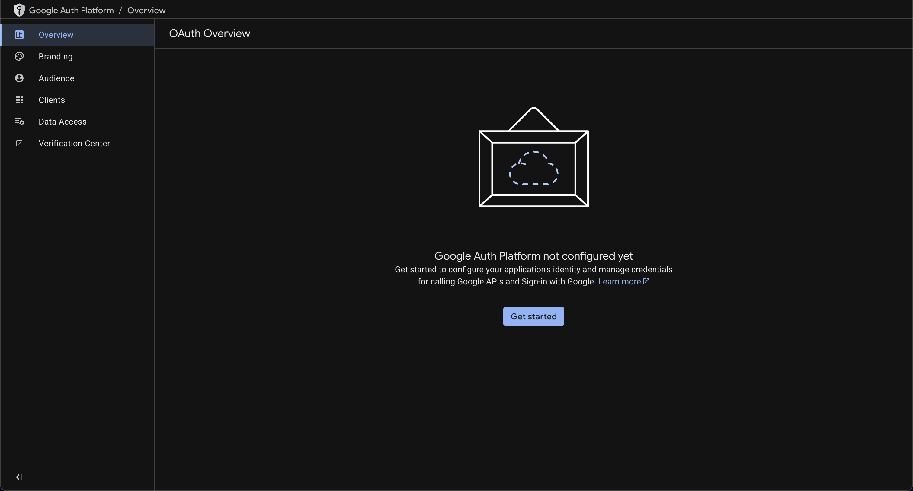
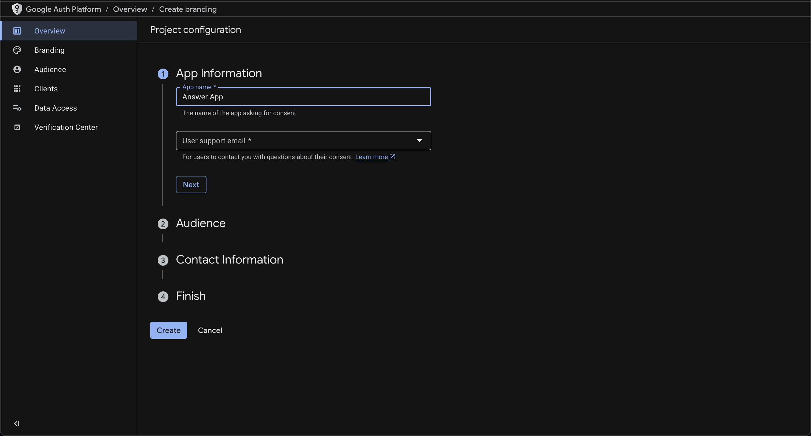
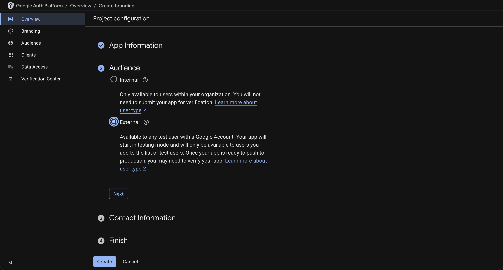
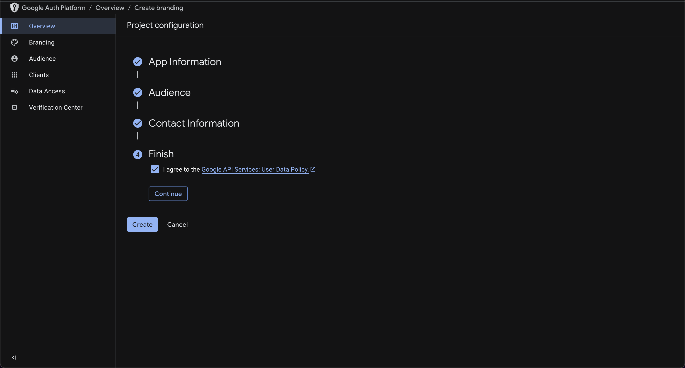
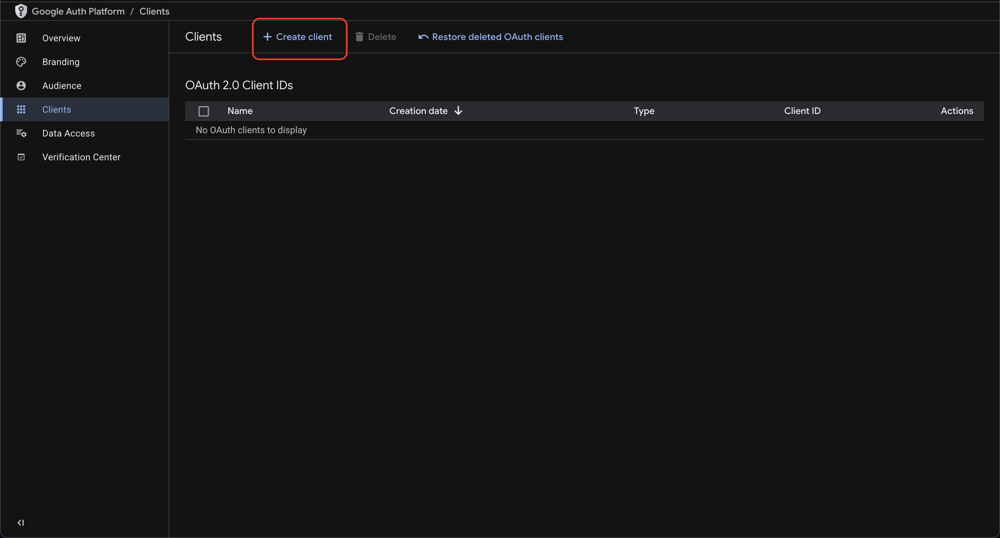
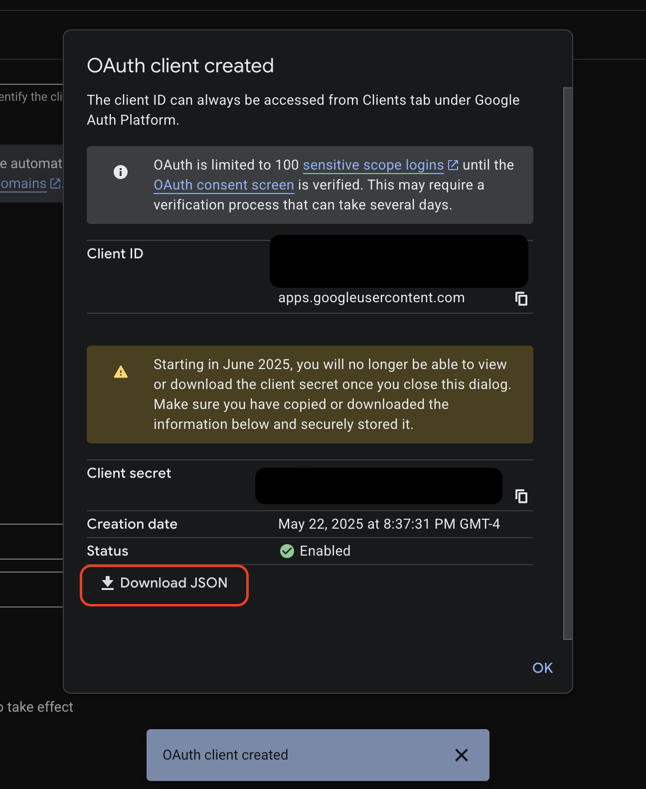
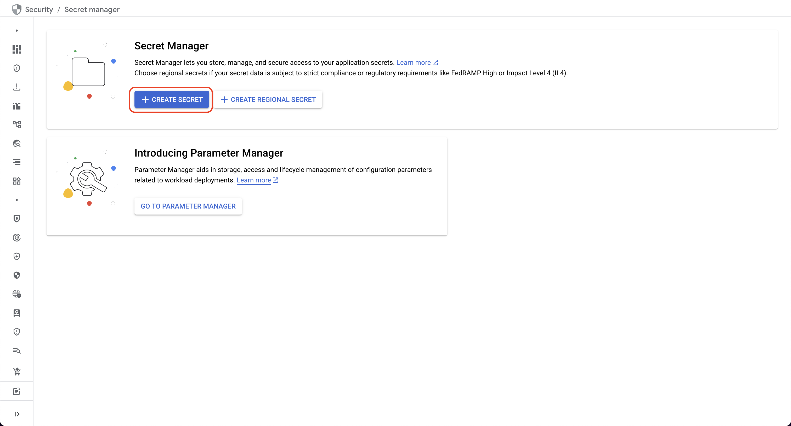
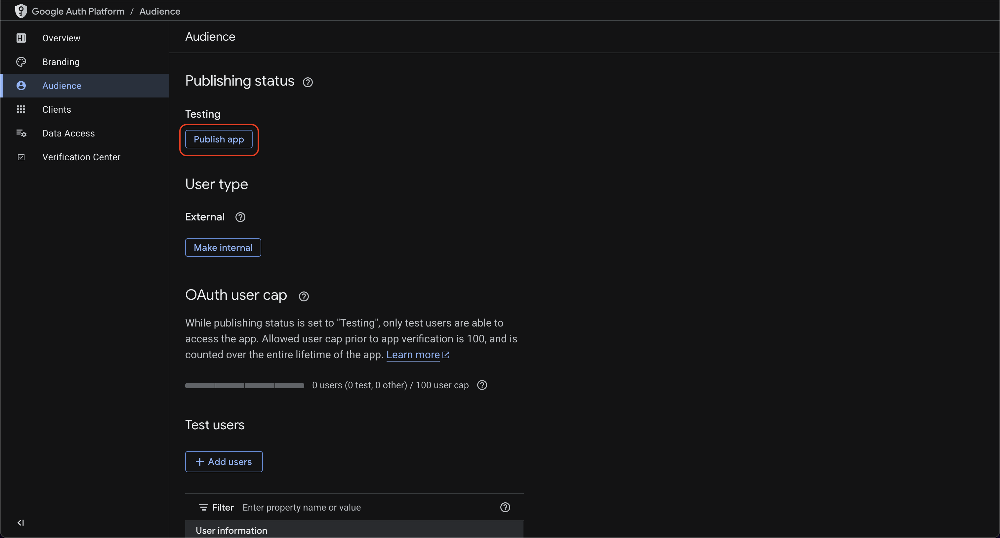

# OAuth Setup

[← Back to README](../../README.md)

The `answer-app-client` uses [Google OAuth 2.0](https://developers.google.com/identity/protocols/oauth2) with Streamlit's [`st.login`](https://docs.streamlit.io/develop/api-reference/user/st.login) feature to securely access limited user profile data for personalized sessions. You must use the Google Cloud Console to initialize the project's [OAuth consent screen](https://developers.google.com/workspace/guides/configure-oauth-consent) (a.k.a. "App Branding") before enabling [OAuth client](https://support.google.com/cloud/answer/15549257) credentials for the `answer-app-client` application. A consent screen is what is shown to a user to display which elements of their information are requested by the app and to let them choose whether to proceed.

## 1. Create Branding

**Reference:** [Manage OAuth App Branding](https://support.google.com/cloud/answer/15549049)

- In the Google Cloud console, go to Menu > Google Auth platform > [Branding](https://console.cloud.google.com/auth/branding). Click "Get started" if you see the message " Google Auth Platform not configured yet".
- Enter an App name (e.g. "Answer App") and an email address you control for User support email.
- Choose External audience.
- Enter a developer contact email address (any address you control, can be the same as the support email).
- Check the box to agree to the data policy and click Create.

<details>
<summary style="cursor: pointer; font-weight: bold; color: #8833c5;">
🖼️ Show/Hide Screenshots
</summary>

<div style="margin-top: 10px;">






</div>
</details>

## 2. Create an OAuth Client

**Reference:** [Manage OAuth Clients](https://support.google.com/cloud/answer/15549257)

- Navigate in the Cloud Console to Google Auth Platform > [Clients](https://console.cloud.google.com/auth/clients) > Create client.
- Create a "Web application" type and name the OAuth client (e.g "answer-app-oauth-client").
- Click Add URI under Authorized Redirect URIs and add `URIs 1` For local testing: `http://localhost:8080/oauth2callback`.
    - Only add the `localhost` redirect URI at this time and don't enter any additional URIs.
    - After deployment you'll return to the Cloud Console and [add `URIs 2` for the deployed app](#5-post-deployment-update-oauth-client-authorized-uris): i.e. a value similar to `https://app.example.com/oauth2callback` or `https://35.244.148.105.sslip.io/oauth2callback` depending on your selected load balancer domain or deployed IP address.
- Click Create.
- Click "Download JSON" in the next dialog popup to save the OAuth client data to your device.
- Save the downloaded JSON file to the local repository `.streamlit/secrets` directory.
    - The `.streamlit/secrets` subdirectory is an ignore pattern in the repo root `.gcloudignore` file.
    - It should exist as an otherwise empty directory containing a `.gitignore` file to prevent committing sensitive data.

<details>
<summary style="cursor: pointer; font-weight: bold; color: #8833c5;">
🖼️ Show/Hide Screenshots
</summary>

<div style="margin-top: 10px;">





</div>
</details>

## 3. Upload the Client Secrets file to Secret Manager

**Reference:** [Add a secret version](https://cloud.google.com/secret-manager/docs/add-secret-version)

- Navigate in the Cloud Console to Security > [Secret Manager](https://console.cloud.google.com/security/secret-manager).
- Enable the API if prompted.
- Click CREATE SECRET.
- Name the secret `answer-app-oauth-client-secret-json`.
- Under Secret value, click BROWSE to upload the client secret JSON file from the previous step.
- Click CREATE SECRET.

<details>
<summary style="cursor: pointer; font-weight: bold; color: #8833c5;">
🖼️ Show/Hide Screenshots
</summary>

<div style="margin-top: 10px;">




</div>
</details>

## 4. Enable a Public Audience

**Reference:** [Manage App Audience](https://support.google.com/cloud/answer/15549945)

- Navigate in the Cloud Console to Google Auth Platform > [Audience](https://console.cloud.google.com/auth/audience)
- Click Publish app under Publishing status
- Click Confirm in the Push to production? dialog box.

A public audience (an "External" User Type and "In production" Publishing status) allows you to add any Google identity to the Identity Aware Proxy access policy.

<details>
<summary style="cursor: pointer; font-weight: bold; color: #8833c5;">
🖼️ Show/Hide Screenshots
</summary>

<div style="margin-top: 10px;">




</div>
</details>

## 5. Post-deployment: Update OAuth Client Authorized URIs

After deploying the cloud resources, add the Terraform output value for `deployed_client_redirect_uri` as an authorized redirect URI in the "Answer App" Web application OAuth client.

- Terraform output values are displayed at the end of the Cloud Build logs.
- Display the specific output value:
```sh
(cd terraform/main && terraform output -raw "deployed_client_redirect_uri")
```

Example output:
```txt
https://35.244.148.105.sslip.io/oauth2callback
```

- Return to the Google Cloud Console and add this value to `URIs 2` in your OAuth client configuration. (Refer to the [Create an OAuth Client](#2-create-an-oauth-client) section.)
